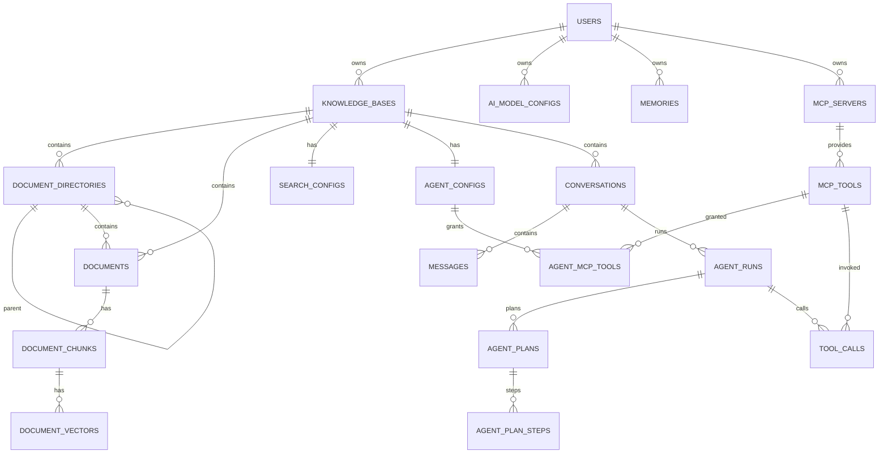

# AI 智能知识库与知识服务 Agent 系统数据库设计文档

> 版本：MVP P0 轻量化版  
> 数据库：PostgreSQL + pgvector  
> 核心表数量：20  
> 对应需求：统一问答 + Router Agent + ReAct-RAG + Plan-Execute + 跨会话长期记忆

---

# 1. 设计目标

本版本以“够用、清晰、便于三人并行开发”为原则，不为每一种 Agent 执行事件单独建表。

核心策略：

1. Router 结果并入 `agent_runs`；
2. ReAct 轮次并入 `agent_runs.execution_trace JSONB`；
3. Reviewer 结果并入 `agent_runs`；
4. Replan 通过 `agent_plans.version / is_current / replan_reason` 表达；
5. Citation 并入 `messages.citations JSONB`；
6. KnowledgeSearch、DocumentRead、MCP 调用统一进入 `tool_calls`；
7. Memory 操作历史降为 P1，不建 `memory_operations`；
8. MinIO 文件信息放入 `documents/import_tasks`，不建 `document_attachments`；
9. 文档索引版本通过 `documents.active_index_version` + `chunks/vectors.index_version` 管理，不建独立索引版本表。

因此 P0 控制为 20 张核心表，同时保留需求中的全部主要功能。

---

# 2. 技术与命名约定

```sql
CREATE EXTENSION IF NOT EXISTS pgcrypto;
CREATE EXTENSION IF NOT EXISTS vector;
```

约定：

- 主键：UUID，默认 `gen_random_uuid()`；
- 时间：`timestamptz`；
- JSON 结构：`jsonb`；
- 逻辑删除：`deleted_at`；
- 敏感凭证：应用层加密后保存为 `bytea`；
- 状态字段：`varchar` + Go 常量；
- 数据隔离：所有用户资源必须通过 `user_id` 校验；
- 知识库资源还必须校验 `knowledge_base_id`。

---

# 3. P0 20 张核心表

| # | 表名 | 作用 |
|---:|---|---|
| 1 | `users` | 用户 |
| 2 | `knowledge_bases` | 知识库 |
| 3 | `document_directories` | 文档目录 |
| 4 | `documents` | 文档、来源及 MinIO 信息 |
| 5 | `document_chunks` | 文档片段与全文检索字段 |
| 6 | `document_vectors` | 文档向量 |
| 7 | `import_tasks` | 文件/URL 导入任务 |
| 8 | `search_configs` | 搜索配置 |
| 9 | `ai_model_configs` | Chat/Embedding/Reranker 配置 |
| 10 | `conversations` | 问答会话 |
| 11 | `messages` | 问答消息 + Citation |
| 12 | `agent_configs` | 每知识库 Agent 配置 |
| 13 | `agent_runs` | Router/ReAct/Reviewer/运行结果统一记录 |
| 14 | `agent_plans` | Plan 及重规划版本 |
| 15 | `agent_plan_steps` | PlanStep |
| 16 | `tool_calls` | 内部工具 + MCP 工具统一调用记录 |
| 17 | `memories` | 长期记忆 |
| 18 | `mcp_servers` | MCP Server |
| 19 | `mcp_tools` | MCP 工具发现缓存 |
| 20 | `agent_mcp_tools` | Agent 对 MCP 工具授权关系 |

---

# 4. ER 关系



---

# 5. 表结构

## 5.1 users

| 字段 | 类型 | NULL | 说明 |
|---|---|---:|---|
| id | uuid | 否 | 主键 |
| username | varchar(64) | 否 | 用户名，唯一 |
| email | varchar(255) | 否 | 邮箱，唯一 |
| password_hash | varchar(255) | 否 | 密码哈希 |
| nickname | varchar(64) | 是 | 昵称 |
| avatar_url | text | 是 | 头像 |
| bio | varchar(500) | 是 | 简介 |
| status | varchar(20) | 否 | active/disabled |
| last_login_at | timestamptz | 是 | 最近登录 |
| created_at | timestamptz | 否 | 创建 |
| updated_at | timestamptz | 否 | 更新 |
| deleted_at | timestamptz | 是 | 删除 |

关键约束：

```sql
UNIQUE(username)
UNIQUE(email)
```

---

## 5.2 knowledge_bases

| 字段 | 类型 | NULL | 说明 |
|---|---|---:|---|
| id | uuid | 否 | 主键 |
| user_id | uuid | 否 | 所属用户 |
| name | varchar(128) | 否 | 名称 |
| description | text | 是 | 简介 |
| icon | varchar(255) | 是 | 图标 |
| default_language | varchar(32) | 否 | 默认 zh-CN |
| qa_enabled | boolean | 否 | AI 问答 |
| agent_enabled | boolean | 否 | Agent |
| network_enabled | boolean | 否 | 联网权限，默认 false |
| default_chat_model_id | uuid | 是 | ChatModel |
| default_embedding_model_id | uuid | 是 | Embedding |
| default_reranker_model_id | uuid | 是 | Reranker |
| created_at | timestamptz | 否 | 创建 |
| updated_at | timestamptz | 否 | 更新 |
| deleted_at | timestamptz | 是 | 删除 |

索引：

```sql
CREATE INDEX idx_kb_user_updated
ON knowledge_bases(user_id, updated_at DESC)
WHERE deleted_at IS NULL;
```

---

## 5.3 document_directories

| 字段 | 类型 | NULL | 说明 |
|---|---|---:|---|
| id | uuid | 否 | 主键 |
| user_id | uuid | 否 | 用户 |
| knowledge_base_id | uuid | 否 | 知识库 |
| parent_id | uuid | 是 | 父目录 |
| name | varchar(128) | 否 | 名称 |
| depth | smallint | 否 | 1~5 |
| sort_order | int | 否 | 排序 |
| is_default | boolean | 否 | 默认目录 |
| created_at | timestamptz | 否 | 创建 |
| updated_at | timestamptz | 否 | 更新 |
| deleted_at | timestamptz | 是 | 删除 |

```sql
CHECK (depth BETWEEN 1 AND 5)
```

---

## 5.4 documents

文档表同时保存来源和原始 MinIO 对象信息，因此不再单独建附件表。

| 字段 | 类型 | NULL | 说明 |
|---|---|---:|---|
| id | uuid | 否 | 主键 |
| user_id | uuid | 否 | 用户 |
| knowledge_base_id | uuid | 否 | 知识库 |
| directory_id | uuid | 是 | 目录 |
| title | varchar(500) | 否 | 标题 |
| content | text | 是 | 解析后/手工正文 |
| source_type | varchar(20) | 否 | manual/file/url |
| source_url | text | 是 | 网页来源 |
| original_file_name | varchar(500) | 是 | 原文件名 |
| file_size | bigint | 是 | 文件大小 |
| mime_type | varchar(128) | 是 | MIME |
| file_hash | varchar(64) | 是 | SHA-256 |
| minio_bucket | varchar(128) | 是 | bucket |
| minio_object_key | text | 是 | object key |
| processing_status | varchar(32) | 否 | 知识处理状态 |
| failure_step | varchar(64) | 是 | 失败步骤 |
| failure_reason | text | 是 | 失败原因 |
| content_version | int | 否 | 内容版本，默认 1 |
| chunk_version | int | 否 | 当前分段版本 |
| active_index_version | int | 是 | 当前可检索索引版本 |
| embedding_model_id | uuid | 是 | 当前 active Embedding |
| chunk_config_hash | varchar(64) | 是 | 分段配置 Hash |
| created_at | timestamptz | 否 | 创建 |
| updated_at | timestamptz | 否 | 更新 |
| deleted_at | timestamptz | 是 | 删除 |

状态：

```text
pending
parsing
cleaning
chunking
embedding
keyword_indexing
succeeded
failed
```

---

## 5.5 document_chunks

每次重新索引产生新的 `index_version` Chunk；旧版本暂时保留，后台清理。

| 字段 | 类型 | NULL | 说明 |
|---|---|---:|---|
| id | uuid | 否 | 主键 |
| user_id | uuid | 否 | 用户 |
| knowledge_base_id | uuid | 否 | 知识库 |
| document_id | uuid | 否 | 文档 |
| chunk_no | int | 否 | 片段序号 |
| content | text | 否 | 正文 |
| char_count | int | 否 | 字符数 |
| token_count | int | 否 | Token 数 |
| context_title | text | 是 | 上下文标题 |
| heading_path | jsonb | 是 | 标题路径 |
| source_location | jsonb | 是 | 页码/章节/位置 |
| content_version | int | 否 | 内容版本 |
| chunk_version | int | 否 | 分段版本 |
| index_version | int | 否 | 索引版本 |
| chunk_config_hash | varchar(64) | 否 | 分段配置 Hash |
| fts_tokens | text | 否 | Go 分词结果 |
| fts_vector | tsvector | 否 | PostgreSQL FTS |
| created_at | timestamptz | 否 | 创建 |

```sql
UNIQUE(document_id, index_version, chunk_no)

CREATE INDEX idx_chunks_fts
ON document_chunks USING GIN(fts_vector);

CREATE INDEX idx_chunks_filter
ON document_chunks(user_id, knowledge_base_id, document_id, index_version);
```

RetrievalService 必须通过：

```text
document_chunks.index_version = documents.active_index_version
```

过滤当前版本。

---

## 5.6 document_vectors

| 字段 | 类型 | NULL | 说明 |
|---|---|---:|---|
| id | uuid | 否 | 主键 |
| user_id | uuid | 否 | 用户 |
| knowledge_base_id | uuid | 否 | 知识库 |
| document_id | uuid | 否 | 文档 |
| chunk_id | uuid | 否 | Chunk |
| index_version | int | 否 | 索引版本 |
| embedding_model_id | uuid | 否 | Embedding 模型 |
| embedding_dim | int | 否 | 向量维度 |
| embedding | vector | 否 | 向量 |
| status | varchar(20) | 否 | pending/ready/failed |
| created_at | timestamptz | 否 | 创建 |

索引过滤条件同样必须匹配 `documents.active_index_version`。

确定实际维度后建立 HNSW，例如 1024 维：

```sql
CREATE INDEX idx_document_vectors_hnsw_1024
ON document_vectors
USING hnsw ((embedding::vector(1024)) vector_cosine_ops)
WHERE embedding_dim = 1024 AND status = 'ready';
```

---

## 5.7 import_tasks

| 字段 | 类型 | NULL | 说明 |
|---|---|---:|---|
| id | uuid | 否 | 主键 |
| user_id | uuid | 否 | 用户 |
| knowledge_base_id | uuid | 否 | 知识库 |
| target_directory_id | uuid | 是 | 目标目录 |
| source_type | varchar(20) | 否 | file/url |
| file_name | varchar(500) | 是 | 文件名 |
| file_size | bigint | 是 | 大小 |
| mime_type | varchar(128) | 是 | MIME |
| source_url | text | 是 | URL |
| source_hash | varchar(128) | 是 | 去重辅助 |
| minio_bucket | varchar(128) | 是 | 上传阶段 bucket |
| minio_object_key | text | 是 | 上传阶段 object key |
| duplicate_policy | varchar(20) | 否 | create_new/skip |
| status | varchar(20) | 否 | pending/running/succeeded/failed/skipped |
| current_step | varchar(64) | 是 | 当前步骤 |
| failure_reason | text | 是 | 失败原因 |
| document_id | uuid | 是 | 成功后的 Document |
| created_at | timestamptz | 否 | 创建 |
| started_at | timestamptz | 是 | 开始 |
| completed_at | timestamptz | 是 | 完成 |

---

## 5.8 search_configs

一个知识库一条。

| 字段 | 类型 | 默认 |
|---|---|---|
| id | uuid | - |
| knowledge_base_id | uuid | - |
| keyword_top_k | int | 30 |
| vector_top_k | int | 30 |
| rrf_k | int | 60 |
| rrf_top_k | int | 20 |
| reranker_top_k | int | 8 |
| reranker_threshold | numeric(8,6) | NULL |
| minimum_effective_results | int | 1 |
| min_vector_score | numeric(8,6) | 0.3 |
| reranker_model_id | uuid | NULL |
| created_at | timestamptz | now() |
| updated_at | timestamptz | now() |

```sql
UNIQUE(knowledge_base_id)
```

---

## 5.9 ai_model_configs

| 字段 | 类型 | NULL | 说明 |
|---|---|---:|---|
| id | uuid | 否 | 主键 |
| user_id | uuid | 否 | 用户 |
| model_type | varchar(20) | 否 | chat/embedding/reranker |
| provider | varchar(64) | 否 | 提供商 |
| name | varchar(128) | 否 | 模型名 |
| base_url | text | 否 | API 地址 |
| api_key_ciphertext | bytea | 是 | 加密 Key |
| api_key_masked | varchar(64) | 是 | 脱敏展示 |
| timeout_seconds | int | 否 | 超时 |
| retry_times | int | 否 | 重试 |
| max_tokens | int | 是 | 最大 Token |
| temperature | numeric(4,3) | 是 | 温度 |
| vector_dimension | int | 是 | Embedding 维度 |
| supports_tool_calling | boolean | 否 | Tool Calling |
| supports_streaming | boolean | 否 | Streaming |
| is_default | boolean | 否 | 用户级默认 |
| enabled | boolean | 否 | 启用 |
| created_at | timestamptz | 否 | 创建 |
| updated_at | timestamptz | 否 | 更新 |
| deleted_at | timestamptz | 是 | 删除 |

---

## 5.10 conversations

| 字段 | 类型 | NULL | 说明 |
|---|---|---:|---|
| id | uuid | 否 | 主键 |
| user_id | uuid | 否 | 用户 |
| knowledge_base_id | uuid | 否 | 知识库 |
| title | varchar(255) | 是 | 标题 |
| status | varchar(20) | 否 | active/archived |
| created_at | timestamptz | 否 | 创建 |
| updated_at | timestamptz | 否 | 更新 |
| deleted_at | timestamptz | 是 | 删除 |

---

## 5.11 messages

Citation 直接保存在 Assistant 消息中。

| 字段 | 类型 | NULL | 说明 |
|---|---|---:|---|
| id | uuid | 否 | 主键 |
| conversation_id | uuid | 否 | 会话 |
| user_id | uuid | 否 | 用户 |
| knowledge_base_id | uuid | 否 | KB |
| agent_run_id | uuid | 是 | Assistant 回答对应 Run |
| role | varchar(20) | 否 | user/assistant |
| content | text | 否 | 正文 |
| citations | jsonb | 是 | KB/Network 引用数组 |
| model_config_id | uuid | 是 | 模型 |
| input_tokens | int | 是 | 输入 Token |
| output_tokens | int | 是 | 输出 Token |
| response_time_ms | bigint | 是 | 响应时间 |
| status | varchar(20) | 否 | streaming/completed/failed |
| created_at | timestamptz | 否 | 创建 |

Citation 示例：

```json
[
  {
    "source_type": "knowledge_base",
    "document_id": "...",
    "document_title": "...",
    "chunk_id": "...",
    "quoted_text": "...",
    "source_location": {"page": 10},
    "document_updated_at": "..."
  },
  {
    "source_type": "network",
    "title": "...",
    "url": "https://...",
    "site_name": "...",
    "published_at": null,
    "fetched_at": "..."
  }
]
```

---

## 5.12 agent_configs

| 字段 | 类型 | 默认 |
|---|---|---|
| id | uuid | - |
| user_id | uuid | - |
| knowledge_base_id | uuid | - |
| name | varchar(128) | Default Agent |
| system_prompt | text | NULL |
| chat_model_id | uuid | - |
| max_react_rounds | int | 8 |
| max_plan_steps | int | 5 |
| max_replans | int | 1 |
| reviewer_runs | int | 1 |
| max_tool_calls | int | 10 |
| max_document_read_tokens | int | 6000 |
| max_tool_result_bytes | int | 1048576 |
| max_run_seconds | int | 300 |
| network_enabled | boolean | false |
| memory_enabled | boolean | true |
| memory_top_k | int | 8 |
| show_execution_status | boolean | true |
| status | varchar(20) | active |
| created_at | timestamptz | now() |
| updated_at | timestamptz | now() |

```sql
UNIQUE(knowledge_base_id)
CHECK (max_plan_steps BETWEEN 1 AND 5)
CHECK (max_replans BETWEEN 0 AND 1)
CHECK (reviewer_runs BETWEEN 0 AND 1)
```

没有 `default_execution_mode`。

---

## 5.13 agent_runs

这是本次轻量化的核心。

| 字段 | 类型 | NULL | 说明 |
|---|---|---:|---|
| id | uuid | 否 | AgentRunID |
| user_id | uuid | 否 | 用户 |
| knowledge_base_id | uuid | 否 | KB |
| conversation_id | uuid | 否 | 会话 |
| user_message_id | uuid | 否 | 用户问题消息 |
| assistant_message_id | uuid | 是 | 最终回答消息 |
| agent_config_id | uuid | 否 | AgentConfig |
| retry_of_run_id | uuid | 是 | 整体重试来源 |
| query | text | 否 | 当前任务 |
| execution_mode | varchar(20) | 是 | react/plan_execute |
| router_reason_summary | varchar(1000) | 是 | Router 原因 |
| router_confidence | numeric(5,4) | 是 | 0~1 |
| router_fallback_used | boolean | 否 | 非法输出是否兜底 |
| knowledge_status | varchar(20) | 是 | sufficient/insufficient/ambiguous |
| execution_trace | jsonb | 是 | ReAct 轮次/阶段事件摘要 |
| replan_count | int | 否 | 0~1 |
| reviewer_result | varchar(32) | 是 | pass/needs_attention/failed |
| reviewer_summary | text | 是 | Reviewer 摘要 |
| memory_used_count | int | 否 | 使用 Memory 数 |
| status | varchar(20) | 否 | queued/running/completed/failed/cancelled |
| input_tokens | int | 否 | 输入 Token |
| output_tokens | int | 否 | 输出 Token |
| total_tokens | int | 否 | 总 Token |
| duration_ms | bigint | 是 | 耗时 |
| final_result | text | 是 | 最终结果 |
| error_code | varchar(64) | 是 | 错误码 |
| error_message | text | 是 | 错误 |
| started_at | timestamptz | 是 | 开始 |
| ended_at | timestamptz | 是 | 结束 |
| created_at | timestamptz | 否 | 创建 |

`execution_trace` 示例：

```json
[
  {
    "type": "agent.round.started",
    "round": 1,
    "tool": "knowledge_search",
    "summary": "检索知识库",
    "duration_ms": 0,
    "timestamp": "..."
  },
  {
    "type": "agent.round.completed",
    "round": 1,
    "summary": "获得 6 个有效片段",
    "duration_ms": 210,
    "timestamp": "..."
  }
]
```

不得写入完整 Chain-of-Thought。

---

## 5.14 agent_plans

重新规划不单独建表。

| 字段 | 类型 | NULL | 说明 |
|---|---|---:|---|
| id | uuid | 否 | PlanID |
| agent_run_id | uuid | 否 | Run |
| version | int | 否 | 1 或 2 |
| goal | text | 否 | 任务目标 |
| completion_criteria | jsonb | 是 | 完成条件 |
| status | varchar(20) | 否 | pending/executing/replanning/reviewing/completed/failed/cancelled |
| is_current | boolean | 否 | 当前 Plan |
| replan_reason | text | 是 | version=2 时原因 |
| created_at | timestamptz | 否 | 创建 |
| completed_at | timestamptz | 是 | 完成 |

```sql
UNIQUE(agent_run_id, version)
CHECK (version BETWEEN 1 AND 2)

CREATE UNIQUE INDEX uq_current_plan
ON agent_plans(agent_run_id)
WHERE is_current = true;
```

---

## 5.15 agent_plan_steps

| 字段 | 类型 | NULL | 说明 |
|---|---|---:|---|
| id | uuid | 否 | StepID |
| plan_id | uuid | 否 | Plan |
| step_no | int | 否 | 1~5 |
| title | varchar(255) | 否 | 标题 |
| description | text | 是 | 描述 |
| depends_on | jsonb | 否 | 依赖步骤数组 |
| recommended_tool | varchar(128) | 是 | 建议工具 |
| completion_criteria | text | 是 | 完成条件 |
| status | varchar(20) | 否 | pending/running/completed/failed/skipped/cancelled |
| input_summary | text | 是 | 输入摘要 |
| output_summary | text | 是 | 输出摘要 |
| error_code | varchar(64) | 是 | 错误 |
| error_message | text | 是 | 错误 |
| started_at | timestamptz | 是 | 开始 |
| ended_at | timestamptz | 是 | 结束 |
| created_at | timestamptz | 否 | 创建 |

```sql
UNIQUE(plan_id, step_no)
CHECK (step_no BETWEEN 1 AND 5)
```

---

## 5.16 tool_calls

统一保存三种调用：

```text
knowledge_search
document_read
mcp
```

| 字段 | 类型 | NULL | 说明 |
|---|---|---:|---|
| id | uuid | 否 | ToolCallID |
| agent_run_id | uuid | 否 | Run |
| plan_step_id | uuid | 是 | Plan 模式 |
| react_round_no | int | 是 | ReAct 模式的轮次 |
| tool_name | varchar(128) | 否 | 工具名 |
| tool_type | varchar(20) | 否 | internal/mcp |
| mcp_server_id | uuid | 是 | MCP 时填写 |
| mcp_tool_id | uuid | 是 | MCP 时填写 |
| status | varchar(20) | 否 | running/succeeded/failed/timeout/cancelled |
| arguments_redacted | jsonb | 是 | 脱敏参数 |
| input_summary | text | 是 | 输入摘要 |
| output_summary | text | 是 | 输出摘要 |
| result_meta | jsonb | 是 | URL、结果数、HTTP 状态等非敏感数据 |
| response_bytes | bigint | 是 | 返回大小 |
| is_truncated | boolean | 否 | 是否截断 |
| error_code | varchar(64) | 是 | 错误 |
| error_message | text | 是 | 错误 |
| duration_ms | bigint | 是 | 耗时 |
| started_at | timestamptz | 否 | 开始 |
| ended_at | timestamptz | 是 | 结束 |

MCP 不再另建 `mcp_tool_calls`。

---

## 5.17 memories

| 字段 | 类型 | NULL | 说明 |
|---|---|---:|---|
| id | uuid | 否 | MemoryID |
| user_id | uuid | 否 | 用户 |
| memory_type | varchar(20) | 否 | preference/project/decision/goal/fact/progress |
| scope_type | varchar(20) | 否 | user/knowledge_base |
| scope_id | uuid | 是 | KB Scope |
| content | text | 否 | 规范化正文 |
| summary | text | 是 | 摘要 |
| importance | numeric(5,4) | 否 | 0~1 |
| content_hash | varchar(64) | 否 | 去重辅助 |
| embedding | vector | 否 | 向量 |
| embedding_dim | int | 否 | 维度 |
| embedding_model_id | uuid | 否 | 模型 |
| source_conversation_id | uuid | 是 | 来源会话 |
| source_message_id | uuid | 是 | 来源消息 |
| source_agent_run_id | uuid | 是 | 来源 Run |
| status | varchar(20) | 否 | active/inactive/deleted |
| created_at | timestamptz | 否 | 创建 |
| updated_at | timestamptz | 否 | 更新 |
| last_accessed_at | timestamptz | 是 | 最近使用 |
| deleted_at | timestamptz | 是 | 删除 |

```sql
CHECK (importance BETWEEN 0 AND 1)
CHECK (
  (scope_type = 'user' AND scope_id IS NULL)
  OR
  (scope_type = 'knowledge_base' AND scope_id IS NOT NULL)
)
```

Memory 新增/合并/更新/失效的完整操作历史属于 P1。

---

## 5.18 mcp_servers

| 字段 | 类型 | NULL | 说明 |
|---|---|---:|---|
| id | uuid | 否 | ServerID |
| user_id | uuid | 否 | 用户 |
| name | varchar(128) | 否 | 名称 |
| description | text | 是 | 描述 |
| transport | varchar(32) | 否 | 固定 streamable_http |
| url | text | 否 | 地址 |
| headers_ciphertext | bytea | 是 | 加密 Header |
| auth_ciphertext | bytea | 是 | 加密认证 |
| auth_masked | varchar(255) | 是 | 脱敏 |
| connect_timeout_ms | int | 否 | 连接超时 |
| call_timeout_ms | int | 否 | 调用超时 |
| max_response_bytes | int | 否 | 最大返回 |
| enabled | boolean | 否 | 启用 |
| connection_status | varchar(20) | 否 | unknown/available/unavailable |
| last_tested_at | timestamptz | 是 | 测试时间 |
| last_error | text | 是 | 错误 |
| created_at | timestamptz | 否 | 创建 |
| updated_at | timestamptz | 否 | 更新 |
| deleted_at | timestamptz | 是 | 删除 |

---

## 5.19 mcp_tools

| 字段 | 类型 | NULL | 说明 |
|---|---|---:|---|
| id | uuid | 否 | ToolID |
| server_id | uuid | 否 | Server |
| tool_name | varchar(255) | 否 | 名称 |
| description | text | 是 | 描述 |
| input_schema | jsonb | 否 | JSON Schema |
| schema_hash | varchar(64) | 否 | Hash |
| read_only | boolean | 否 | 是否只读 |
| enabled | boolean | 否 | Server 级启用 |
| discovered_at | timestamptz | 否 | 发现时间 |
| last_checked_at | timestamptz | 否 | 最后检查 |
| schema_changed_at | timestamptz | 是 | Schema 变化 |
| created_at | timestamptz | 否 | 创建 |
| updated_at | timestamptz | 否 | 更新 |

```sql
UNIQUE(server_id, tool_name)
```

---

## 5.20 agent_mcp_tools

| 字段 | 类型 | NULL | 说明 |
|---|---|---:|---|
| id | uuid | 否 | 主键 |
| agent_config_id | uuid | 否 | Agent |
| mcp_tool_id | uuid | 否 | MCP Tool |
| enabled | boolean | 否 | 授权 |
| created_at | timestamptz | 否 | 创建 |
| updated_at | timestamptz | 否 | 更新 |

```sql
UNIQUE(agent_config_id, mcp_tool_id)
```

运行时允许 MCP 调用必须同时满足：

```text
knowledge_bases.network_enabled = true
AND agent_configs.network_enabled = true
AND mcp_servers.enabled = true
AND mcp_tools.enabled = true
AND mcp_tools.read_only = true
AND agent_mcp_tools.enabled = true
```

---

# 6. 文档索引版本如何在不建额外表的情况下工作

旧设计为索引版本单独建表；P0 可以更简单。

## 6.1 构建

假设：

```text
documents.active_index_version = 1
```

重新索引：

```text
生成 chunk.index_version = 2
→ 生成 vector.index_version = 2
→ 全部成功
→ 事务更新 documents.active_index_version = 2
```

## 6.2 检索

关键词：

```sql
SELECT c.*
FROM document_chunks c
JOIN documents d ON d.id = c.document_id
WHERE d.user_id = :user_id
  AND d.knowledge_base_id = :kb_id
  AND d.deleted_at IS NULL
  AND d.processing_status = 'succeeded'
  AND c.index_version = d.active_index_version;
```

向量同理。

## 6.3 优点

- 少一张表；
- 原子切换只需更新 Document；
- 新版本失败不影响旧版本；
- 旧版本后台物理清理；
- 仍支持 Embedding/分段变化后的重建。

---

# 7. 关键索引

```sql
CREATE INDEX idx_documents_owner
ON documents(user_id, knowledge_base_id, updated_at DESC)
WHERE deleted_at IS NULL;

CREATE INDEX idx_chunks_filter
ON document_chunks(user_id, knowledge_base_id, document_id, index_version);

CREATE INDEX idx_chunks_fts
ON document_chunks USING GIN(fts_vector);

CREATE INDEX idx_vectors_filter
ON document_vectors(user_id, knowledge_base_id, document_id, index_version, status);

CREATE INDEX idx_conversation_messages
ON messages(conversation_id, created_at);

CREATE INDEX idx_agent_runs_owner
ON agent_runs(user_id, knowledge_base_id, created_at DESC);

CREATE INDEX idx_tool_calls_run
ON tool_calls(agent_run_id, started_at);

CREATE INDEX idx_memories_scope
ON memories(user_id, status, scope_type, scope_id);
```

---

# 8. RetrievalService 强制过滤

所有检索必须至少包含：

```text
current user_id
current knowledge_base_id
documents.deleted_at IS NULL
documents.processing_status = succeeded
chunk/vector.index_version = documents.active_index_version
vector.status = ready
```

DocumentID、ChunkID 不能替代用户和知识库隔离条件。

---

# 9. MemoryRetriever 强制过滤

```text
user_id = current_user
status = active
scope_type = user
OR
scope_type = knowledge_base AND scope_id = current_kb
```

再进行 pgvector 相似度检索，并结合：

- 相似度；
- importance；
- last_accessed_at；

选出最终 TopK。

Memory 不作为知识事实 Citation。

---

# 10. ToolCall 统一设计

内部工具：

```text
tool_type = internal
tool_name = knowledge_search / document_read
mcp_server_id = NULL
mcp_tool_id = NULL
```

MCP：

```text
tool_type = mcp
tool_name = web_search / fetch_url / ...
mcp_server_id != NULL
mcp_tool_id != NULL
```

因此：

- Agent 运行详情只查询一个表；
- MCP 调用历史也查询同一表；
- 不需要双份日志；
- 统计工具成功率更简单。

---

# 11. 事务边界

## 11.1 创建知识库

一个短事务创建：

```text
knowledge_bases
document_directories(default)
search_configs
agent_configs
```

## 11.2 提交问题

短事务：

```text
insert user message
insert agent_run(status=queued)
commit
```

Agent 异步执行，不持有数据库长事务。

## 11.3 Agent 完成

短事务：

```text
insert/update assistant message(citations JSONB)
update agent_run
commit
```

随后异步执行 MemoryExtractor。

## 11.4 索引切换

所有新 Chunk/Vector 构建完成后：

```sql
BEGIN;
UPDATE documents
SET active_index_version = :new_version,
    processing_status = 'succeeded',
    updated_at = now()
WHERE id = :document_id
  AND user_id = :user_id;
COMMIT;
```

---

# 12. 不再单独建表的内容

| 原设计 | P0 处理方式 |
|---|---|
| document_attachments | 合并到 documents / import_tasks |
| citations | messages.citations JSONB |
| router_decisions | agent_runs |
| agent_replans | agent_plans.version/replan_reason |
| agent_reviews | agent_runs.reviewer_* |
| agent_rounds | agent_runs.execution_trace JSONB |
| memory_operations | P1 |
| mcp_tool_calls | tool_calls |
| document_index_versions | documents.active_index_version |

这不是删除功能，而是减少持久化实体。

---

# 13. GORM 实现建议

UUID：

```go
ID uuid.UUID `gorm:"type:uuid;default:gen_random_uuid();primaryKey"`
```

JSONB：

```go
ExecutionTrace datatypes.JSON `gorm:"type:jsonb"`
Citations      datatypes.JSON `gorm:"type:jsonb"`
```

Repository 查询资源时强制：

```text
id
+ user_id
+ knowledge_base_id（知识库资源）
+ deleted_at IS NULL
```

不要在 Service 层先查 ID 再遗漏 owner 校验。

---

# 14. P0 建表顺序

```text
1. users
2. ai_model_configs
3. knowledge_bases
4. document_directories
5. search_configs
6. agent_configs
7. documents
8. import_tasks
9. document_chunks
10. document_vectors
11. conversations
12. messages
13. agent_runs
14. agent_plans
15. agent_plan_steps
16. memories
17. mcp_servers
18. mcp_tools
19. agent_mcp_tools
20. tool_calls
```

---

# 15. 验收清单

- [ ] P0 核心表为 20 张；
- [ ] Router 结果可从 AgentRun 查询；
- [ ] ReAct 执行轨迹可从 AgentRun 查询；
- [ ] Reviewer 结果可从 AgentRun 查询；
- [ ] Plan 最多两个版本；
- [ ] ToolCall 同时覆盖内部工具和 MCP；
- [ ] Citation 可从 Assistant Message 查询；
- [ ] Memory UserID 强隔离；
- [ ] MCP 写工具无法启用；
- [ ] 新索引失败不会影响旧 ActiveIndexVersion；
- [ ] RetrievalService 强制匹配 ActiveIndexVersion；
- [ ] API Key/MCP Credential 不明文存储；
- [ ] 不保存模型完整内部思维链。
