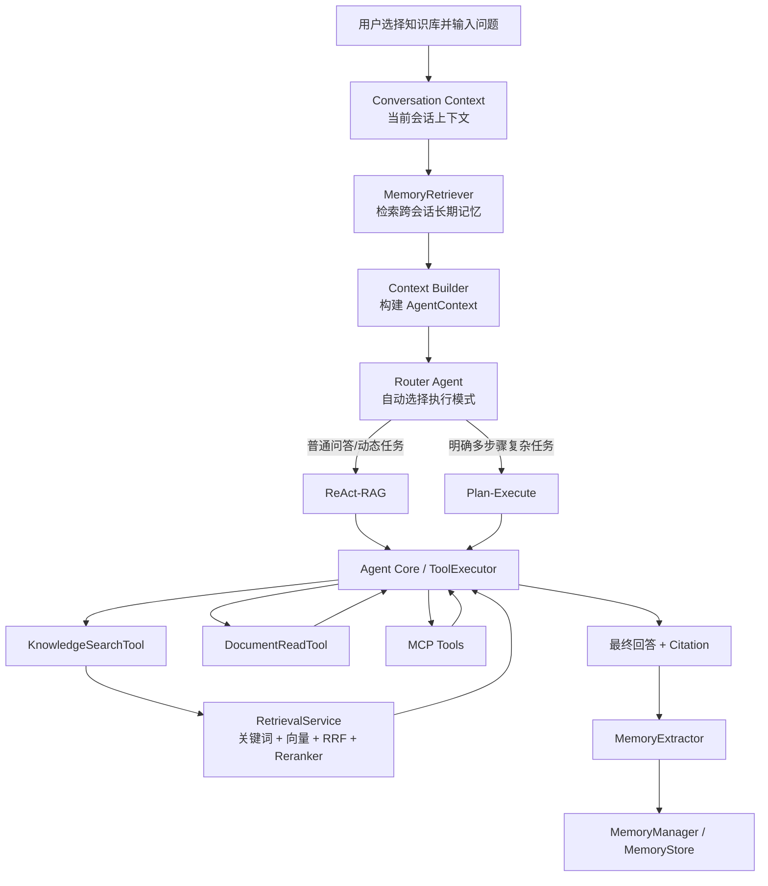

# AI 智能知识库与知识服务 Agent 系统需求规格说明书

> 版本：MVP P0（统一问答 + Router Agent + ReAct-RAG + Plan-Execute + 跨会话长期记忆 + 轻量化数据设计）

# 1. 引言
## 1.1 文档目的
本文档用于说明 AI 智能知识库与知识服务 Agent 系统 MVP 版本的建设目标、用户范围、业务流程、功能需求、数据要求、非功能需求、项目分工、开发边界和验收标准。
本文档主要面向：
- 产品负责人；
- 项目管理人员；
- 后端开发人员；
- AI、RAG 与 Agent 开发人员；
- 前端开发人员；
- 测试和项目验收人员。
本文档重点描述“系统需要实现什么”。详细数据库表、OpenAPI、跨模块 DTO 和具体 Go 接口应在《数据字典与接口契约》中维护；部署拓扑、组件选型和内部实现细节应在《系统架构设计说明书》中维护；里程碑、分支规范和联调计划应在《项目分工与开发计划》中维护。
## 1.2 项目背景
个人在学习、开发和日常工作过程中，会持续积累技术文档、学习资料、Markdown 笔记、PDF 文件、网页资料、项目文档和个人总结。

传统个人知识管理方式通常存在以下问题：
1. 学习资料分散在本地文件、网页和不同笔记中；
2. 不同格式资料难以统一管理；
3. 随着资料增加，传统目录和关键词搜索越来越难以快速找到需要的信息；
4. 普通关键词搜索无法准确理解用户问题；
5. 多篇文档之间存在关联，但人工总结、比较和归纳成本较高；
6. 用户需要重复阅读大量资料才能形成知识体系；
7. 普通知识库通常只能完成资料存储和搜索，难以主动完成复杂知识任务；
8. AI 生成内容与知识库资料之间缺少可靠引用；
9. 单纯依靠本地知识库无法回答最新技术、软件版本和行业动态问题；
10. 外部工具接入方式不统一，Agent 难以安全调用联网搜索、网页读取等能力；
11. 普通对话系统通常只理解当前会话，用户切换会话后，项目背景、重要决策、长期目标和稳定偏好容易丢失；
12. 如果让用户手动选择 RAG、ReAct 或 Plan-Execute，会增加使用成本，也容易出现执行模式选择错误。

因此，本项目建设一套面向个人用户的 AI 智能知识库与知识服务 Agent 系统。系统将个人资料统一导入知识库，通过文档解析、清洗、分段、向量化、关键词检索、向量检索和重排序构建可检索知识。

系统采用统一智能问答入口。用户只需要选择知识库并输入问题，系统先整理当前会话上下文，再检索与当前问题相关的跨会话长期记忆，随后由 Router Agent 自动判断使用 ReAct 还是 Plan-Execute 执行任务。

ReAct 与 RAG 在问答执行层融合：ReAct 负责动态决策和工具调用，RAG 检索链路作为 ReAct 获取知识库依据的核心能力。对于普通知识问答，ReAct 通常只需调用一次 KnowledgeSearchTool 即可完成；对于步骤不固定的问题，可以继续检索、读取完整文档或调用联网 MCP 工具。

Plan-Execute 用于需要明确拆分多个步骤的复杂任务，先生成结构化计划，再按步骤执行，并在必要时进行一次重新规划和一次完整性检查。ReAct 和 Plan-Execute 共用 Agent Core、ToolRegistry、ToolExecutor、上下文与长期记忆能力。
## 1.3 产品定位
本系统是一款面向个人用户的 AI 智能知识库与知识服务平台。

用户可以在一个账号下创建多个相互隔离的知识库，将学习资料、技术文档、项目文档和个人笔记加工为可检索知识。

系统只提供一个统一智能问答入口，核心执行链路为：

用户问题
→ 当前会话上下文整理
→ 跨会话长期记忆检索
→ Context Builder 构建统一上下文
→ Router Agent 自动选择 ReAct 或 Plan-Execute
→ 调用知识库检索、文档读取或已启用的只读 MCP 工具
→ 生成回答和真实引用
→ Memory Extractor 判断是否产生新的长期记忆
→ Memory Store 新增、合并或更新记忆。

其中：
1. ReAct-RAG：适合普通知识问答和执行步骤不固定的任务。ReAct 根据当前状态动态决定是否调用 KnowledgeSearchTool、DocumentReadTool 或 MCP 工具；知识库检索由统一 RetrievalService 完成关键词检索、向量检索、RRF 融合和 Reranker；
2. Plan-Execute：适合需要明确拆分多个子任务、存在步骤依赖或需要阶段性汇总的复杂任务。Planner 生成结构化计划，Executor 按步骤执行，必要时最多重新规划一次，并由 Reviewer 进行一次完整性检查。

用户不需要手动选择 ReAct 或 Plan-Execute，Router Agent 自动完成执行模式路由。

MVP 主要提供：
- 多知识库管理；
- 本地文件和普通静态网页 URL 导入；
- PDF、DOCX、Markdown、TXT 解析；
- 文档清洗、分段和索引版本管理；
- Embedding 和 pgvector 向量索引；
- PostgreSQL 关键词检索；
- 关键词与向量的 RRF 混合检索；
- Reranker；
- 统一智能问答入口；
- 当前会话上下文；
- 跨会话长期记忆；
- Router Agent；
- ReAct-RAG；
- 简化版 Plan-Execute Agent；
- 统一 Agent Core；
- KnowledgeSearchTool；
- DocumentReadTool；
- Streamable HTTP MCP Server 配置；
- MCP 工具发现、启停和只读调用；
- 通过 MCP 接入第三方联网搜索和网页读取；
- 回答引用来源；
- Agent 运行记录和工具调用记录；
- AI 模型配置。
## 1.4 项目目标
MVP 版本的主要目标如下：
1. 支持用户创建和管理多个相互隔离的知识库；
2. 支持本地文件和普通静态网页 URL 导入；
3. 支持 PDF、DOCX、Markdown、TXT 文档解析；
4. 支持文档清洗、分段、Embedding 和索引版本切换；
5. 支持关键词检索、向量检索、RRF 混合检索和 Reranker；
6. 支持统一智能问答入口，用户无需手动选择执行模式；
7. 支持当前会话上下文理解和多轮指代补全；
8. 支持跨会话长期记忆的提取、存储、检索、合并、更新和失效；
9. 支持 Router Agent 根据完整上下文自动选择 ReAct 或 Plan-Execute；
10. 支持 ReAct-RAG 动态调用知识库检索、文档读取和只读 MCP 工具；
11. 支持 Plan-Execute 生成结构化计划、逐步执行、一次重新规划和一次 Reviewer 检查；
12. 支持统一 Agent Core、ToolRegistry 和 ToolExecutor；
13. 支持 KnowledgeSearchTool 和受限的 DocumentReadTool；
14. 支持通过 Streamable HTTP MCP 接入第三方联网搜索和网页读取；
15. 支持只读工具授权、调用次数、执行轮数、超时和返回大小限制；
16. 支持回答引用来源、知识不足判断和 SSE 流式输出；
17. 支持记录 Router 选择、Agent 计划、执行步骤、执行轮次、工具调用、Memory 操作、Token、耗时和最终结果；
18. 为后续 Checkpoint、SubAgent、多 Agent、可视化工作流和更高级的记忆策略预留扩展接口。
## 1.5 项目范围
### 1.5.1 MVP P0 包含

基础业务
- 初始化账号或简单登录；
- 用户基础信息管理；
- 多知识库管理；
- 文档目录管理；
- 文档创建、查看和删除；
- 本地文件导入；
- 普通静态网页 URL 导入；
- 导入任务管理；
- AI 模型配置；
- 问答会话与消息记录；
- Agent 运行记录。

知识处理与 RAG
- PDF、DOCX、Markdown、TXT 解析；
- 文档清洗；
- 按标题、段落和 Token 限制分段；
- Embedding；
- pgvector 向量索引；
- PostgreSQL 关键词检索；
- 向量检索；
- RRF 混合检索；
- Reranker；
- 索引版本切换和重建；
- 知识依据充分性判断；
- 知识库引用；
- ReAct 最终回答中的 RAG 上下文构建。

上下文与长期记忆
- 当前会话最近消息读取；
- 简单多轮指代补全；
- Conversation Context 截断；
- Context Builder；
- MemoryStore；
- MemoryRetriever；
- MemoryExtractor；
- MemoryManager；
- 长期记忆 Embedding；
- PostgreSQL + pgvector 记忆向量检索；
- 记忆类型和作用域；
- 记忆新增、去重、合并、更新、失效和删除；
- 记忆来源追踪；
- 用户查看和删除长期记忆。

Router Agent
- 基于当前问题、会话上下文和相关长期记忆判断任务类型；
- 自动选择 ReAct 或 Plan-Execute；
- 结构化 RouterDecision；
- 记录路由模式和可展示的选择原因摘要；
- Router 不直接执行知识库或 MCP 工具。

Agent Core
- AgentRunService；
- ToolRegistry；
- ToolExecutor；
- ToolContext；
- RunController；
- BudgetController；
- CitationCollector；
- EventPublisher；
- Agent 任务异步执行；
- 最大轮数、最大步骤数和最大工具调用次数；
- 任务停止和整体重试；
- 统一运行事件和工具调用记录。

Plan-Execute Agent
- Planner；
- 结构化 Plan 和 PlanStep；
- 步骤依赖和执行顺序；
- Executor；
- 工具调用；
- 步骤结果传递；
- 最多一次重新规划；
- 最多一次 Reviewer 完整性检查。

ReAct-RAG
- ReAct 执行循环；
- Agent Runner；
- ToolsNode；
- Tool Calling；
- KnowledgeSearchTool 调用；
- DocumentReadTool 调用；
- 工具观察结果回传；
- 最大执行轮数和调用次数；
- 流式执行状态；
- 最终回答和引用。

MCP
- MCP Server 配置；
- Streamable HTTP；
- 连接测试；
- 工具发现；
- 工具元数据和输入 Schema 缓存；
- 工具启用和停用；
- 只读工具授权；
- 第三方联网搜索 MCP；
- 第三方网页读取 MCP；
- MCP 返回结果适配；
- 凭证加密和脱敏；
- 超时、返回大小和 SSRF 限制；
- MCP 工具调用记录。
### 1.5.2 MVP P0 不包含
- 企业组织架构和成员协作；
- 多租户；
- 文档级复杂权限；
- 在线富文本编辑器；
- AI 辅助写作和文档改写；
- Agent 预设任务模板体系；
- Agent 自动创建、修改、覆盖或发布知识库文档；
- SubAgent 和多 Agent 协作；
- 任意节点 Checkpoint 恢复；
- 可视化工作流编辑器；
- 任意代码执行沙箱；
- Sitemap、RSS、OCR；
- 扫描版 PDF 文字识别；
- 知识图谱；
- 第三方机器人；
- MCP stdio；
- MCP 写工具；
- 工具调用人工确认和暂停后恢复；
- 多次动态重新规划；
- 高级 Reviewer 反思循环；
- Plan 历史版本对比页面；
- 完整系统操作日志查询页面；
- Agent 高级指标统计；
- 复杂记忆图谱、记忆自反思和多阶段记忆推理。
# 2. 总体描述
## 2.1 系统总体结构
系统由以下模块组成：
1. 用户与认证模块；
2. 知识库管理模块；
3. 文档目录模块；
4. 文档管理模块；
5. 内容导入模块；
6. 文档解析与知识索引模块；
7. 搜索与 RAG 核心模块；
8. AI 模型配置模块；
9. 会话与问答记录模块；
10. 上下文与长期记忆模块；
11. Router Agent 模块；
12. Agent Core；
13. Plan-Execute Agent 模块；
14. ReAct-RAG 模块；
15. Agent 工具模块；
16. MCP 配置与工具管理模块；
17. Agent 运行记录模块。

系统围绕个人用户和个人知识库展开，不建设企业成员体系。用户只通过统一智能问答入口提交问题，不直接选择执行模式。

## 2.2 技术层次
系统分为传统业务层、RAG 核心层、上下文与长期记忆层、Router 层、Agent Core、Agent 编排层和工具接入层。

### 2.2.1 传统业务层
负责：
- 用户认证；
- 知识库和文档业务；
- 文件上传和 MinIO 对象存储；
- 导入任务；
- 模型配置；
- 会话与消息记录；
- Agent 配置；
- Plan、PlanStep 和 AgentRun 数据；
- MCP 配置数据；
- Memory 元数据。

推荐技术：
- Go；
- Gin；
- GORM；
- PostgreSQL；
- pgvector；
- Redis；
- MinIO；
- 异步任务组件。

### 2.2.2 RAG 核心层
负责：
- Loader；
- Parser；
- Transformer；
- 文档清洗和分段；
- Embedding；
- Indexer；
- 关键词检索；
- 向量检索；
- RRF 混合检索；
- Reranker；
- 知识充分性判断；
- 检索引用来源。

主要链路：
原始资料
→ 文档正文
→ 文档片段
→ 关键词索引与向量索引
→ RetrievalService
→ 混合检索
→ Reranker
→ ToolResult + Citation。

RAG 核心层不再提供独立的用户问答入口。知识库检索主要通过 KnowledgeSearchTool 被 ReAct-RAG 和 Plan-Execute 复用。

### 2.2.3 上下文与长期记忆层
负责：
- 当前会话消息读取；
- 会话窗口截断；
- 简单指代补全；
- MemoryExtractor；
- MemoryRetriever；
- MemoryStore；
- MemoryManager；
- 记忆 Embedding；
- 记忆相关性检索；
- 记忆去重、合并、更新、失效和删除；
- Context Builder。

统一上下文至少包含：
- 当前用户问题；
- 当前会话必要历史；
- 与问题相关的长期记忆；
- 当前知识库 ID；
- 联网权限。

### 2.2.4 Router Agent 层
Router Agent 是统一智能问答入口的路由组件，负责：
- 理解基于完整上下文的当前任务；
- 判断任务是否需要明确的多步骤计划；
- 自动选择 ReAct 或 Plan-Execute；
- 输出结构化 RouterDecision；
- 记录可展示的路由原因摘要。

Router Agent 不直接调用 KnowledgeSearchTool、DocumentReadTool 或 MCP 工具，避免把路由和执行逻辑混合。

### 2.2.5 Agent Core
Agent Core 是 Plan-Execute 和 ReAct 的公共运行基础，负责：
- AgentRunService；
- ToolRegistry；
- ToolExecutor；
- 运行时 ToolContext 注入；
- Agent 异步任务；
- 任务停止、超时和取消；
- 轮数、步骤、Token 和工具调用预算；
- 引用收集；
- SSE 事件发布；
- 错误处理；
- 工具调用记录。

Plan-Execute 和 ReAct 不得分别重复建设上述能力。

### 2.2.6 Agent 编排层
Plan-Execute 负责：
- Planner；
- 结构化 Plan 和 PlanStep；
- Executor；
- 步骤依赖；
- 步骤结果传递；
- 最多一次重新规划；
- Reviewer 完整性检查；
- Graph 状态流转。

ReAct-RAG 负责：
- ReAct Agent；
- Agent Runner；
- ToolsNode；
- Tool Calling；
- 根据工具结果动态决定下一步；
- 调用 KnowledgeSearchTool 获取 RAG 检索结果；
- 最终回答生成。

### 2.2.7 工具与 MCP 接入层
负责：
- KnowledgeSearchTool；
- DocumentReadTool；
- MCP Client；
- MCP Server 连接；
- 工具发现；
- Tool Schema 适配；
- 第三方联网搜索和网页读取；
- 只读工具授权；
- 工具超时、重试、返回大小和日志；
- URL 与 MCP 请求的 SSRF 防护。
## 2.3 用户模型
MVP 采用个人用户模式。

用户可以：
- 创建多个知识库；
- 导入和管理自己的资料；
- 在统一智能问答页面直接提交问题；
- 由 Router Agent 自动选择 ReAct 或 Plan-Execute；
- 在同一会话中进行多轮对话；
- 在不同会话之间使用相关长期记忆；
- 查看和删除系统保存的长期记忆；
- 配置一个默认 ChatModel、一个 Embedding 模型和一个 Reranker 模型；
- 配置 Streamable HTTP MCP Server；
- 启用或停用只读 MCP 工具；
- 查看 Router 选择、Plan、步骤、ReAct 执行轮次、工具调用和最终结果。

MVP 不支持多个用户共同管理同一个知识库。
## 2.4 技术选型原则
1. PostgreSQL 同时存储普通业务数据、全文检索字段和长期记忆元数据；
2. pgvector 存储文档片段向量和长期记忆向量；
3. 中文关键词检索优先采用 Go 侧分词后写入 PostgreSQL simple 配置的全文检索字段，避免 MVP 阶段依赖复杂数据库中文分词扩展；
4. 关键词结果与向量结果使用 RRF 融合，再由 Reranker 排序；
5. MinIO 保存原始文件；
6. Redis 用于短期运行状态、任务停止信号或缓存，不作为核心业务数据唯一存储；
7. Eino 用于模型、RAG 组件、Graph、Agent、Tool、Stream 和 Callback 等能力；
8. Router、Planner、ReAct、Reviewer 和 MemoryExtractor 默认复用统一 ChatModel，通过 ModelFactory 获取；
9. 长期记忆复用默认 Embedding 模型生成向量，避免引入额外向量数据库；
10. 业务模块不得硬编码模型 API Key、地址和超时策略。
## 2.5 核心问答架构



核心原则：
1. 用户只提交问题，不手动选择 ReAct 或 Plan-Execute；
2. Router 只负责路由，不直接调用业务工具；
3. RAG 是 ReAct-RAG 和 Plan-Execute 共用的底层知识检索能力，不再作为独立用户模式；
4. 当前会话上下文和长期记忆在 Router 之前完成整理；
5. 长期记忆写入在回答完成后异步执行，不阻塞当前回答。

# 3. 核心业务流程
## 3.1 知识库创建流程
1. 用户登录系统；
2. 用户进入知识库列表；
3. 用户创建知识库；
4. 用户填写名称、简介等信息；
5. 系统校验数据；
6. 系统创建知识库；
7. 系统创建默认目录；
8. 系统创建默认搜索配置；
9. 系统创建默认 Agent 配置；
10. 用户进入知识库控制台。

默认搜索配置至少包括：关键词检索 TopK、向量检索 TopK、RRF 参数、Reranker 返回数量和知识不足阈值。

默认 Agent 配置至少包括：最大 ReAct 轮数、最大 Plan 步骤数、最大重新规划次数、最大工具调用次数、是否允许联网和是否启用长期记忆。系统不设置“默认执行模式”，每次任务由 Router Agent 自动路由。

## 3.2 文档导入与知识构建流程
1. 用户上传文件或输入 URL；
2. 系统校验文件类型、大小或 URL；
3. 原始文件保存到 MinIO；
4. 系统创建导入任务；
5. Loader 加载资料；
6. Parser 提取正文、标题结构和来源位置；
7. Transformer 清洗内容；
8. Transformer 按标题、段落、语义完整性和最大 Token 数分段；
9. 系统记录内容版本、分段版本和索引版本；
10. Embedding 将片段转换为向量；
11. Indexer 将向量写入 pgvector；
12. 系统构建关键词检索字段；
13. 新索引版本全部完成后原子切换为 active；
14. 旧索引版本标记为 inactive，并由后台任务清理；
15. 文档进入搜索和 Agent 可用状态。

文档摘要、关键词和标签属于 P1 增强能力，不阻塞 P0 索引构建。

## 3.3 统一智能问答与路由流程
1. 用户选择知识库并输入问题；
2. 系统确认当前用户、当前知识库和会话；
3. ConversationContextService 读取当前会话必要历史，并按消息数或 Token 上限截断；
4. MemoryRetriever 根据当前问题检索相关跨会话长期记忆；
5. Context Builder 将当前问题、会话上下文、长期记忆、知识库 ID 和联网权限组合为统一 AgentContext；
6. Router Agent 分析任务复杂度和执行特点；
7. Router Agent 输出结构化 RouterDecision，自动选择 ReAct 或 Plan-Execute；
8. Agent Core 创建 AgentRun，并记录路由结果；
9. 系统进入对应执行引擎；
10. 最终回答通过 SSE 流式返回；
11. 系统保存问答消息、AgentRun、引用、Token 和耗时；
12. 回答完成后异步调用 MemoryExtractor，判断本轮是否产生值得跨会话保存的信息；
13. MemoryManager 对候选记忆执行新增、合并、更新或忽略。

Router Agent 只负责路由，不直接执行工具。

## 3.4 ReAct-RAG 执行流程
1. Router Agent 选择 ReAct；
2. Agent Core 创建或继续当前 AgentRun，并加载允许使用的工具；
3. ReAct 根据 AgentContext 和当前工具观察结果判断下一步动作；
4. 需要知识库资料时调用 KnowledgeSearchTool；
5. KnowledgeSearchTool 调用 RetrievalService；
6. RetrievalService 执行关键词检索和向量检索；
7. 系统使用 RRF 合并并去重结果；
8. Reranker 重新排序并返回高质量片段和引用；
9. 如检索结果不足，ReAct 可以调整查询再次检索，或调用 DocumentReadTool 读取更多正文；
10. 如需要最新或外部信息，ReAct 可以调用已授权的只读 MCP 工具；
11. ToolExecutor 将统一 ToolResult 返回 ReAct；
12. ReAct 根据结果继续调用工具或生成最终答案；
13. Agent Core 流式返回执行状态、最终答案和引用；
14. 系统保存执行轮次、工具调用和运行结果。

对于普通知识问答，ReAct 通常只需一次 KnowledgeSearchTool 调用即可完成，因此不再提供独立“普通 RAG”执行模式。

## 3.5 Plan-Execute Agent 执行流程
1. Router Agent 判断当前任务需要明确多步骤执行，选择 Plan-Execute；
2. Agent Core 创建或继续当前 AgentRun，并注入统一 AgentContext 和 ToolContext；
3. Planner 分析任务目标和完成条件；
4. Planner 生成最多 5 个步骤的结构化计划；
5. 系统保存 Plan 和 PlanStep；
6. Executor 按依赖顺序执行当前步骤；
7. 需要知识库资料时调用 KnowledgeSearchTool 或 DocumentReadTool；
8. 需要外部信息时调用已授权的只读 MCP 工具；
9. 系统保存步骤状态和结果摘要；
10. 如资料不足或步骤失败，最多重新规划一次剩余步骤；
11. 所有步骤完成后，Reviewer 最多检查一次结果完整性和引用；
12. 系统生成最终结果和引用；
13. Agent Core 保存运行状态、Token、耗时和工具调用记录。

## 3.6 跨会话长期记忆流程
长期记忆用于保存跨会话仍然具有价值的稳定信息，例如项目背景、重要决策、长期目标、稳定偏好、任务进度和事实性上下文。长期记忆与完整聊天记录分开保存。

读取流程：
1. 用户输入问题；
2. 系统获取当前 UserID；
3. MemoryRetriever 使用当前问题生成检索向量；
4. 在 PostgreSQL + pgvector 中按照 UserID、记忆作用域和状态过滤；
5. 检索最相关的候选记忆；
6. 根据相似度、重要性和最近使用时间筛选；
7. 将最终记忆加入 AgentContext；
8. Router、ReAct 或 Plan-Execute 使用这些记忆理解任务。

写入流程：
1. 当前轮问答正常结束；
2. MemoryExtractor 读取本轮用户消息、最终回答和必要上下文；
3. 判断是否存在值得长期保存的信息；
4. 对候选记忆分类并生成规范化内容；
5. MemoryManager 查询是否已有相同或高度相似记忆；
6. 若不存在则新增；
7. 若存在且内容发生变化，则合并或更新；
8. 对过时或被新决策替代的记忆标记为 inactive；
9. 保存来源会话和来源消息，保证可追溯。

P0 不把每条聊天消息直接当作长期记忆，也不要求复杂记忆图谱或多轮记忆反思。

## 3.7 联网搜索流程
系统不自行实现搜索引擎，而是通过 MCP 配置接入第三方搜索和网页读取工具。

Agent
→ ToolRegistry
→ MCP Client
→ 第三方搜索或网页读取 MCP Server
→ 统一 ToolResult

执行流程：
1. ReAct 或 Plan-Execute 判断需要最新或外部信息；
2. 系统检查当前知识库是否允许联网；
3. 系统检查对应只读 MCP 工具是否启用；
4. Agent 生成搜索关键词；
5. MCP Client 调用第三方搜索工具；
6. 系统将搜索结果适配为统一结构；
7. Agent 按需调用网页读取工具；
8. Agent 综合知识库、长期记忆和网络资料；
9. 系统分别生成知识库引用和网络引用；
10. 系统记录 URL、抓取时间、工具名称和调用耗时。

## 3.8 MCP 配置与工具调用流程
1. 用户新增 MCP Server 配置；
2. 用户填写服务名称、Streamable HTTP 地址、请求头和认证信息；
3. 系统加密保存敏感配置；
4. 系统测试连接；
5. 系统获取工具列表、工具描述和输入 Schema；
6. 系统保存工具元数据、Schema Hash 和发现时间；
7. 用户启用允许调用的只读工具；
8. Agent Runtime 加载已启用工具；
9. Agent 生成业务参数；
10. 后端运行时注入用户、知识库和 AgentRun 上下文；
11. 系统校验工具类型、授权、超时和返回大小；
12. MCP Client 调用工具；
13. 系统适配返回结果；
14. Agent 使用结果继续执行；
15. 系统保存调用记录。

P0 不支持写工具，因此不建设工具人工确认和暂停恢复流程。
# 4. 功能需求
## 4.1 用户与认证模块
### 4.1.1 用户登录
系统支持用户名或邮箱加密码登录。
登录成功后返回身份凭证，并记录：
- 用户 ID；
- 登录时间；
- 登录结果。
P0 可以使用初始化账号；开放注册不作为 AI 核心验收项。
### 4.1.2 退出登录
用户可以主动退出当前登录状态，退出后当前身份凭证失效。
### 4.1.3 用户信息管理
用户可以修改：
- 头像；
- 昵称；
- 简介；
- 邮箱；
- 密码。
## 4.2 知识库管理模块
### 4.2.1 创建知识库
字段包括：
- 知识库名称；
- 知识库简介；
- 知识库图标；
- 默认语言；
- AI 问答状态；
- Agent 状态；
- Agent 联网权限；
- 默认模型配置。
业务规则：
1. 一个用户可以创建多个知识库；
2. 每个知识库归属于当前用户；
3. 新知识库默认启用基础搜索；
4. 系统创建默认目录、搜索配置和 Agent 配置；
5. Agent 联网权限默认关闭，由用户主动开启。
### 4.2.2 知识库列表
展示：
- 名称；
- 图标；
- 简介；
- 文档数量；
- 更新时间；
- Agent 状态；
- Agent 联网权限；
- 创建时间。
支持名称搜索、排序和分页。复杂筛选属于 P1。
### 4.2.3 修改知识库
用户可以修改知识库基础信息、搜索配置、Agent 配置、联网权限和默认模型配置。
### 4.2.4 删除知识库
删除前必须二次确认。
删除后：
1. 知识库及关联业务数据立即逻辑删除；
2. 文档、片段和向量立即不再参与搜索、RAG 和 Agent；
3. MinIO 原始文件由后台清理任务物理删除；
4. 清理前已删除文件也不得再次访问。
## 4.3 文档目录模块
系统支持树形目录。
用户可以：
- 创建目录；
- 修改目录名称；
- 删除目录；
- 移动目录；
- 调整目录顺序；
- 在目录下创建文档。
MVP 建议最多支持 5 级目录。
## 4.4 文档管理模块
### 4.4.1 新建文档
用户可以手动创建只读知识文档。
字段包括：
- 文档标题；
- 文档正文；
- 所属目录；
- 来源类型；
- 来源地址。
用户创建文档后，系统自动进入清洗、分段、向量化和索引流程。
MVP 不提供在线编辑和 AI 辅助改写。用户需要更新正文时，应删除原文档并重新创建或重新导入。
### 4.4.2 文档状态
删除状态：
- 正常；
- 已删除。
知识处理状态：
- 待处理；
- 解析中；
- 清洗中；
- 分段中；
- 向量化中；
- 关键词索引中；
- 处理成功；
- 处理失败。
### 4.4.3 查看文档
展示：
- 标题；
- 正文；
- 所属目录；
- 来源类型；
- 来源地址；
- 知识处理状态；
- 创建时间；
- 更新时间。
文档摘要和标签属于 P1。
### 4.4.4 删除文档
删除后：
1. 文档不再显示；
2. 不再参与搜索；
3. 不再参与知识库检索；
4. 不再被 Agent 读取；
5. 对应片段和向量立即失效；
6. 原始文件由后台任务物理清理。
## 4.5 内容导入模块
### 4.5.1 本地文件导入
P0 支持：
- Markdown；
- TXT；
- PDF；
- DOCX。
P0 不支持旧版 DOC 文件。扫描版 PDF 和图片型 PDF 不进行 OCR。
系统校验：
- 文件大小；
- 扩展名；
- MIME 类型；
- 单次上传数量；
- 用户存储限制。
### 4.5.2 URL 内容导入
P0 只保证导入普通静态 HTML 页面，不保证支持登录页面、验证码页面、强 JavaScript 渲染页面和强反爬页面。
系统应：
1. 只允许 HTTP 和 HTTPS；
2. 禁止 localhost、回环地址、私有网段、云元数据地址和 file://；
3. 对每次重定向重新进行安全校验；
4. 限制重定向次数、响应大小和请求超时；
5. 提取主要正文；
6. 清理无效 HTML；
7. 保存来源 URL；
8. 创建文档并进入知识处理流程。
URL 导入用于将网页内容长期保存到知识库；联网搜索用于临时获取最新网络信息，两者必须区分。
### 4.5.3 导入任务
记录：
- 任务 ID；
- 文件名称；
- 文件大小；
- 文件类型；
- URL；
- 知识库 ID；
- 目标目录；
- 任务状态；
- 当前处理步骤；
- 失败原因；
- 创建时间；
- 完成时间。
### 4.5.4 重复内容处理
系统根据文件哈希、URL 和来源判断明显重复内容。
发现重复时，用户可以选择：
- 创建新文档；
- 跳过导入。
MVP 不支持覆盖已有文档。
## 4.6 文档解析与知识索引模块
### 4.6.1 文档加载与解析
提取：
- 标题；
- 正文；
- 标题层级；
- 段落；
- 来源信息；
- 页码或位置；
- 原始文件信息。
P0 不要求提取图片中文字。
### 4.6.2 文档清洗
处理：
- 多余空白；
- 重复页眉页脚；
- 无效字符；
- 无效 HTML；
- 不完整段落；
- 明显重复内容。
### 4.6.3 文档分段
片段记录至少包括：
- 片段 ID；
- 文档 ID；
- 知识库 ID；
- 片段正文；
- 片段顺序；
- 字符数；
- Token 数；
- 上下文标题；
- 来源位置；
- 内容版本；
- 分段版本；
- 索引版本；
- 向量状态；
- 是否为当前 active 版本。
系统优先按照标题层级、段落边界、语义完整性和最大 Token 数分段。
### 4.6.4 向量化
系统调用 Embedding 模型将片段转换为向量，并记录：
- Embedding 模型配置 ID；
- 模型名称；
- 向量维度；
- 索引版本；
- 生成状态。
### 4.6.5 关键词索引
系统对文档标题、片段正文和上下文标题构建 PostgreSQL 全文检索字段。
中文内容优先在 Go 侧进行分词，写入以空格分隔的 Token，再使用 PostgreSQL simple 文本搜索配置生成 tsvector。
### 4.6.6 向量索引和过滤
向量检索至少支持按照以下字段过滤：
- 用户 ID；
- 知识库 ID；
- 文档 ID；
- 文档状态；
- 索引版本；
- active 状态。
### 4.6.7 索引版本更新
以下情况需要生成新索引版本：
- 分段规则变化；
- Embedding 模型变化；
- 向量维度变化；
- 索引结构变化；
- 用户主动重新索引。
索引切换规则：
1. 新版本在 processing 状态独立构建；
2. 新版本全部处理成功后，在事务中切换为 active；
3. 旧版本标记为 inactive；
4. RetrievalService 只读取 active 版本；
5. 旧版本由后台任务异步清理。
### 4.6.8 处理失败
系统记录失败步骤和错误信息，支持整体重试，并确保失败或未激活数据不能进入检索结果。
## 4.7 搜索模块
### 4.7.1 关键词搜索
搜索范围：
- 文档标题；
- 片段正文；
- 上下文标题。
结果展示：
- 文档标题；
- 命中片段；
- 所属目录；
- 关键词分数；
- 文档更新时间；
- 文档地址。
### 4.7.2 AI 语义搜索
系统将查询转换为向量，通过 Retriever 检索相似片段，并根据配置阈值过滤结果。
### 4.7.3 混合搜索
P0 固定流程：
关键词检索 Top 30
+
向量检索 Top 30
→ RRF 融合
→ 去重
→ 取前 20
→ Reranker
→ 最终返回 5～8 个片段
具体数量允许通过搜索配置调整，但不建议 P0 建设复杂权重编辑器。
### 4.7.4 查询补全和改写
P0 只支持：
- 简单多轮指代补全；
- 将当前问题与必要的短期会话上下文组合成检索问题。
以下能力放入 P1：
- 同义词扩展；
- 多查询生成；
- 复杂意图识别；
- 检索关键词生成；
- 多阶段查询改写。
### 4.7.5 Reranker
允许配置：
- 初始检索数量；
- 最终返回数量；
- 相似度阈值；
- Reranker 模型配置。
### 4.7.6 检索测试
P0 提供基础检索测试接口，至少返回：
- 命中文档；
- 命中片段；
- 关键词排名；
- 向量排名；
- RRF 排名；
- Reranker 分数；
- 最终顺序；
- 检索耗时。
复杂可视化和历史对比放入 P1。
## 4.8 统一智能问答与会话上下文模块

### 4.8.1 发起提问
用户在当前知识库中发起提问，问题不能为空并限制最大长度。页面不要求用户选择 ReAct 或 Plan-Execute。

### 4.8.2 当前会话上下文
系统读取当前会话最近消息，用于处理多轮指代和上下文延续。

P0 支持：
- 最近消息窗口；
- Token 上限；
- 超限后优先移除最早消息；
- 简单多轮指代补全；
- 将必要历史整理为 Router 和执行引擎可使用的上下文。

P1 可以增加自动会话摘要，但 P0 不依赖摘要即可工作。

### 4.8.3 Context Builder
Context Builder 统一构建 AgentContext，至少包含：
- UserID；
- KnowledgeBaseID；
- ConversationID；
- UserQuery；
- ConversationContext；
- RetrievedMemories；
- NetworkEnabled；
- 时间和运行限制等必要元数据。

Router、ReAct 和 Plan-Execute 应复用同一份规范化上下文，不重复拼装。

### 4.8.4 引用来源
知识库引用至少包括：
- 文档 ID；
- 文档标题；
- 片段 ID；
- 引用片段；
- 所属知识库；
- 来源位置；
- 文档更新时间。

网络引用至少包括：
- 标题；
- URL；
- 站点名称；
- 发布时间；
- 抓取时间。

长期记忆属于用户上下文，不作为知识事实引用来源。若最终结论依赖知识库或网络事实，仍必须提供对应真实引用。

### 4.8.5 知识不足判断
知识充分状态统一为：
- SUFFICIENT：已有资料足以回答；
- INSUFFICIENT：资料明显不足；
- AMBIGUOUS：资料存在但无法明确支持结论。

满足以下任一条件时，可以判定资料不足或不确定：
1. 没有检索结果；
2. 最终有效结果数量低于最低数量；
3. 最高 Reranker 分数低于配置阈值；
4. 引用内容无法覆盖问题核心；
5. 模型只能给出无来源结论。

资料不足时，ReAct 应明确提示知识库依据不足，并根据联网权限决定是否尝试 MCP；不能将模型自身知识伪装成知识库内容。

### 4.8.6 流式输出
支持：
- Router 执行状态；
- ReAct 执行状态；
- Plan 和步骤状态；
- 逐步展示最终回答；
- 停止生成；
- 异常提示；
- 引用完成事件；
- Memory 写入结果可以异步记录，不阻塞最终答案返回。

### 4.8.7 回答反馈
回答反馈页面和统计属于 P1，不作为 P0 验收项。

## 4.9 Router Agent 与执行配置模块

### 4.9.1 Router Agent
Router Agent 根据 AgentContext 判断使用：
- ReAct；
- Plan-Execute。

Router 的输入至少包含：
- 当前问题；
- 当前会话上下文；
- 相关长期记忆；
- 当前知识库信息；
- 是否允许联网。

RouterDecision 至少包含：
- ExecutionMode：react 或 plan_execute；
- ReasonSummary：可展示的简短选择原因；
- Confidence：可选的路由置信度；
- CreatedAt。

Router 不直接调用业务工具，不保存模型完整内部推理文本。

### 4.9.2 路由原则
优先选择 ReAct 的情况：
- 普通知识库问答；
- 一次或少量检索即可完成；
- 执行步骤无法提前固定；
- 需要根据工具结果动态决定下一步。

优先选择 Plan-Execute 的情况：
- 明确包含多个子目标；
- 存在步骤依赖；
- 需要分阶段收集、分析、比较和汇总；
- 任务完成条件需要逐步检查。

Router 的判断规则应以模型结构化输出为主，后端保留基础兜底规则。例如 Router 输出非法模式时默认进入 ReAct。

### 4.9.3 Agent 配置
配置项包括：
- Agent 名称；
- 系统提示词；
- 使用 ChatModel；
- 最大 ReAct 轮数；
- 最大计划步骤数；
- 最大重新规划次数；
- 最大工具调用次数；
- 最大单次文档读取 Token；
- 是否允许联网；
- 允许使用的只读 MCP 工具；
- 是否启用长期记忆；
- 长期记忆最大召回数量；
- 是否显示执行状态；
- Agent 状态。

P0 默认限制建议：
- 最大 ReAct 轮数：8；
- 最大计划步骤数：5；
- 最大重新规划次数：1；
- Reviewer 次数：1；
- 最大工具调用次数：10；
- 长期记忆最大召回数量：5～10 条。

用户不配置“默认执行模式”，每次任务由 Router 自动选择。
## 4.10 Agent Core
### 4.10.1 AgentRunService
统一负责：
- 创建 AgentRun；
- 更新运行状态；
- 保存执行模式；
- 保存最终结果；
- 保存 Token 和耗时；
- 保存错误信息；
- 处理任务停止和整体重试。
### 4.10.2 RunController
负责：
- 主动停止；
- 上下文取消；
- 总超时；
- 单工具超时；
- 失败状态转换。
P0 不支持任意节点 Checkpoint 和服务器重启后继续执行。
### 4.10.3 BudgetController
统一限制：
- 最大 ReAct 轮数；
- 最大 Plan 步骤数；
- 最大重新规划次数；
- 最大工具调用次数；
- 最大单次工具结果大小；
- 最大单次文档读取 Token；
- 最大运行时间。
### 4.10.4 CitationCollector
统一收集和去重知识库引用与网络引用，并交由 CitationService 格式化。
### 4.10.5 EventPublisher
统一智能问答中的 Router、Plan-Execute 和 ReAct 使用统一 SSE 事件结构。
事件类型至少包括：
- run.started；
- run.completed；
- run.failed；
- run.cancelled；
- router.selected；
- memory.retrieved；
- plan.created；
- plan.replanned；
- step.started；
- step.completed；
- step.failed；
- agent.round.started；
- tool.call.started；
- tool.call.completed；
- tool.call.failed；
- answer.delta；
- citation.created；
- usage.updated；
- memory.updated。
## 4.11 Plan-Execute Agent 模块
### 4.11.1 Planner
Planner 负责：
- 理解任务目标；
- 拆分子任务；
- 确定步骤顺序；
- 指定步骤建议工具；
- 定义完成条件；
- 输出结构化计划。
P0 的计划最多包含 5 个步骤。
### 4.11.2 Executor
Executor 负责：
- 获取当前可执行步骤；
- 通过统一 ToolExecutor 调用工具；
- 保存步骤输入摘要和输出摘要；
- 将前一步结果传递给后续步骤；
- 标记步骤状态；
- 判断计划是否完成；
- 汇总步骤结果。
### 4.11.3 简化重新规划
出现以下情况时可以重新规划一次：
- 检索结果不足；
- 工具调用失败；
- 文档缺失；
- 当前步骤无法完成；
- 新结果改变后续执行路径。
重新规划只修改尚未执行的剩余步骤。旧计划版本保留记录，但不再继续执行。
多次重新规划、任意步骤回滚和计划版本可视化对比放入 P1。
### 4.11.4 Reviewer
Reviewer 只进行一次结果完整性检查：
- 是否回答用户目标；
- 是否完成必要步骤；
- 是否包含有效引用；
- 是否存在明显无依据结论；
- 是否存在失败但未处理的必要步骤。
Reviewer 不进行多轮自我反思和循环重写。
### 4.11.5 Plan 状态
- 待规划；
- 执行中；
- 重新规划中；
- 检查中；
- 已完成；
- 执行失败；
- 已取消。
## 4.12 ReAct Agent 模块
### 4.12.1 功能定位
ReAct-RAG 根据当前任务和工具观察结果循环决定下一步动作，适合普通知识问答以及步骤不固定、需要动态选择工具的任务。RAG 不再作为独立用户执行模式，KnowledgeSearchTool + RetrievalService 是 ReAct 获取知识库依据的核心链路。
### 4.12.2 ReAct 循环
1. 模型分析当前任务状态；
2. 模型选择工具并生成业务参数；
3. ToolsNode 通过 ToolExecutor 执行工具；
4. 统一 ToolResult 写入 Agent 上下文；
5. 模型继续判断下一步动作；
6. 达到完成条件后输出答案。
### 4.12.3 执行限制
- 最大执行轮数；
- 最大工具调用次数；
- 单工具超时；
- 工具结果大小限制；
- 上下文长度限制；
- 用户主动停止；
- 失败后整体重试。
### 4.12.4 可观察执行轨迹
系统可以展示和保存：
- 当前执行轮次；
- 当前工具；
- 工具调用开始和结束；
- 工具输入摘要；
- 工具输出摘要；
- Token；
- 耗时；
- 最终状态。
系统不得保存或展示模型完整内部思维链、隐藏提示词和未脱敏敏感参数。
## 4.13 Agent 工具模块
### 4.13.1 ToolContext
以下字段由后端根据登录状态和当前运行环境注入，模型不可见、不可修改：
- UserID；
- KnowledgeBaseID；
- AgentRunID；
- AllowedToolNames；
- NetworkEnabled。
模型不得通过工具参数传入或覆盖用户 ID 和知识库 ID。
### 4.13.2 KnowledgeSearchTool
KnowledgeSearchTool 调用成员一提供的 RetrievalService。
模型输入：
- 查询内容；
- 检索模式；
- TopK；
- 可选文档范围。
运行时注入：
- 用户 ID；
- 当前知识库 ID；
- AgentRunID。
输出：
- 文档 ID；
- 文档标题；
- 片段 ID；
- 文档片段；
- 关键词排名或分数；
- 向量排名或分数；
- RRF 排名；
- Reranker 分数；
- 引用位置。
工具只返回检索结果，不直接生成最终回答。
### 4.13.3 DocumentReadTool
DocumentReadTool 调用成员一提供的 DocumentService。
模型输入：
- 文档 ID；
- 可选章节标识；
- 可选游标；
- 最大读取 Token。
运行时注入：
- 用户 ID；
- 当前知识库 ID；
- AgentRunID。
输出：
- 文档标题；
- 当前读取正文；
- 来源；
- 更新时间；
- 下一页游标；
- 是否被截断；
- 引用信息。
DocumentReadTool 默认不得一次返回无限长度完整正文，应按章节、游标或 Token 上限读取。
### 4.13.4 ToolRegistry
统一管理：
- KnowledgeSearchTool；
- DocumentReadTool；
- MCP 工具；
- 工具名称和说明；
- 输入参数 Schema；
- 工具类型；
- 只读状态；
- 启用状态；
- 超时和调用限制。
Plan-Execute 和 ReAct 共用同一 ToolRegistry。
### 4.13.5 ToolCall 与 ToolResult
统一 ToolCall 至少包含：
- ToolCallID；
- ToolName；
- JSON Arguments。
统一 ToolResult 至少包含：
- ToolCallID；
- 文本内容；
- 可选结构化数据；
- 引用；
- 是否截断；
- 是否失败；
- 错误码。
调用方不得直接依赖不稳定的 map[string]any 和任意返回类型。
### 4.13.6 工具调用规则
系统应：
- 校验 ToolContext；
- 校验工具是否启用；
- 校验工具是否为允许的只读工具；
- 限制调用次数、超时和结果大小；
- 对输入和输出进行摘要记录；
- 对敏感参数脱敏；
- 对失败返回明确错误码；
- 防止工具绕过知识库隔离。
## 4.14 MCP 配置与工具管理模块
### 4.14.1 MCP Server 配置
P0 只支持 Streamable HTTP。
配置项：
- 服务名称；
- 服务说明；
- 服务地址；
- 请求头；
- 认证信息；
- 连接超时；
- 是否启用。
P0 不提供启动命令、启动参数、工作目录和环境变量形式的 stdio 进程配置。
### 4.14.2 连接测试与工具发现
系统支持：
- 测试连接；
- 测试认证；
- 获取工具列表；
- 获取工具描述；
- 获取输入参数 Schema；
- 保存 Schema Hash；
- 展示错误原因和响应时间。
工具元数据至少保存：
- ServerID；
- ToolName；
- Description；
- InputSchema；
- SchemaHash；
- DiscoveredAt；
- LastCheckedAt；
- Enabled；
- ReadOnly。
工具 Schema 发生变化后，系统应更新缓存并重新校验启用状态。
### 4.14.3 第三方联网搜索和网页读取
搜索结果统一转换为：
- 标题；
- 摘要；
- URL；
- 站点名称；
- 发布时间；
- 抓取时间；
- 相关度信息。
网页读取结果统一转换为：
- 页面标题；
- 页面正文；
- URL；
- 作者；
- 发布时间；
- 抓取时间；
- 是否截断。
### 4.14.4 工具授权
P0 规则：
- 只读工具可以启用；
- 写工具禁止启用；
- 未启用工具禁止调用；
- 知识库未开启联网权限时，禁止调用联网 MCP 工具。
复杂多级授权、写工具和人工确认放入 P1。
### 4.14.5 MCP 安全
- 凭证加密保存；
- 凭证脱敏展示；
- 禁止日志记录明文密钥；
- 限制连接和调用超时；
- 限制返回大小；
- 防止 SSRF；
- 禁止访问本机、内网和云元数据地址；
- 对重定向目标重新进行地址校验；
- 记录 MCP Server、工具、调用耗时和结果状态。
## 4.15 AI 模型配置模块
P0 支持三类模型配置：
- 一个默认 ChatModel；
- 一个默认 Embedding 模型；
- 一个默认 Reranker 模型。
Router、Planner、ReAct、Reviewer 和 MemoryExtractor 默认共用 ChatModel。代码层通过 ModelFactory 保留以后分别配置模型的能力，但 P0 页面不建设多套独立模型配置。
配置项包括：
- 模型提供商；
- 模型名称；
- API 地址；
- API Key；
- 超时时间；
- 重试次数；
- 最大 Token；
- 温度；
- 向量维度；
- Tool Calling 支持；
- 流式输出支持。
API Key 必须加密保存和脱敏展示。
模型连通性测试属于 P1，不作为 P0 核心验收项。
## 4.16 问答与 Agent 运行记录模块
### 4.16.1 智能问答记录
保存：
- 会话 ID；
- 知识库 ID；
- 用户问题；
- AI 回答；
- 引用来源；
- 模型；
- Token；
- 响应时间；
- 创建时间。

P0 的引用来源允许作为问答消息的结构化字段保存，不要求单独建设“回答引用”核心数据实体；但引用仍必须能够追溯到真实文档片段或真实网络 URL。

### 4.16.2 Agent 运行记录
AgentRun 作为统一运行记录，至少保存：
- AgentRunID；
- 用户任务；
- Router 选择的执行模式；
- Router 原因摘要；
- Router 置信度（可选）；
- 运行状态；
- ReAct 当前轮次或执行轨迹摘要；
- 重新规划次数；
- Reviewer 结果摘要；
- 使用的 Memory 数量；
- 开始和结束时间；
- Token；
- 耗时；
- 最终结果；
- 错误信息。

P0 不要求为 RouterDecision、Reviewer、ReAct 执行轮次分别建立独立持久化实体。上述信息可以作为 AgentRun 的结构化字段或执行轨迹保存，但仍必须满足可追溯和页面展示要求。

### 4.16.3 Plan 和步骤记录
Plan-Execute 独立保存：
- 任务目标；
- 计划版本；
- PlanStep；
- 步骤依赖；
- 步骤状态；
- 步骤结果摘要；
- 重新规划原因。

P0 中：
1. Plan 和 PlanStep 仍作为独立核心数据实体；
2. 重新规划通过 Plan 版本和 ReplanReason 表达，不要求单独建设 AgentReplan 实体；
3. Reviewer 结果保存到 AgentRun 或最终 Plan 的结构化字段中，不要求独立 Reviewer 实体；
4. 最多发生一次重新规划，因此同一 AgentRun 的 Plan 版本最多为 2；
5. 不建设 Plan 版本对比页面和版本回滚。

### 4.16.4 执行轨迹和工具调用记录
系统需要保留可观察执行轨迹，包括：
- ReAct 当前执行轮次；
- 当前工具；
- 工具名称；
- 工具类型；
- 输入摘要；
- 输出摘要；
- 调用时间；
- 执行耗时；
- 调用结果；
- 失败原因。

P0 数据落库采用轻量化策略：
- ReAct 轮次和阶段性事件可以保存在 AgentRun 的 ExecutionTrace 等结构化字段中，不要求独立 AgentRound 数据实体；
- KnowledgeSearchTool、DocumentReadTool 和 MCP Tool 的实际调用统一保存为 ToolCall 记录；
- MCP 调用不再额外建设一套独立调用记录实体，可通过 ToolType、MCPServerID 和 MCPToolID 区分。

不得保存模型完整内部推理文本、隐藏提示词和未脱敏敏感参数。

### 4.16.5 运行控制
用户可以：
- 查看当前状态；
- 查看 Plan 和步骤；
- 查看 ReAct 执行轮次和执行轨迹；
- 查看工具调用；
- 停止任务；
- 失败后整体重新执行。

完整系统操作日志、细粒度执行事件历史查询和 Memory 操作历史属于 P1。

## 4.17 跨会话长期记忆模块

### 4.17.1 功能定位
长期记忆用于在不同会话之间保存仍然具有持续价值的信息，使新会话可以恢复必要的用户偏好、项目上下文、重要决策、长期目标、事实和任务进度。

长期记忆与问答消息历史分开保存：
- 问答消息保存完整对话记录；
- Memory 只保存经过提炼、具有长期价值的内容。

### 4.17.2 Memory 类型
P0 建议支持以下固定类型：
- preference：稳定偏好；
- project：项目背景和技术上下文；
- decision：已做出的重要决定；
- goal：长期目标；
- fact：稳定事实；
- progress：长期任务或项目进度。

### 4.17.3 Memory 作用域
每条 Memory 至少包含作用域：
- user：用户全局记忆；
- knowledge_base：指定知识库相关记忆。

检索时必须先按 UserID 隔离，再根据 ScopeType 和 ScopeID 过滤。

### 4.17.4 MemoryExtractor
MemoryExtractor 在一轮问答完成后异步执行，负责：
- 判断本轮是否产生值得长期保存的信息；
- 提取候选记忆；
- 生成规范化文本；
- 判断记忆类型和作用域；
- 给出重要性评分；
- 关联来源会话和消息。

MemoryExtractor 不得把每句话都保存为长期记忆。

### 4.17.5 MemoryRetriever
MemoryRetriever 负责：
- 将当前问题转换为检索向量；
- 使用 UserID 和作用域过滤；
- 通过 pgvector 检索候选 Memory；
- 综合相似度、重要性和状态筛选；
- 返回固定数量的相关 Memory；
- 更新 LastAccessedAt。

### 4.17.6 MemoryManager
MemoryManager 负责：
- 新增 Memory；
- 相似 Memory 去重；
- 新旧信息合并；
- 被新决策替代时更新或失效旧 Memory；
- 用户手动删除；
- 状态管理。

P0 直接在 Memory 当前记录中维护最新内容、状态、更新时间和来源信息，不要求单独建设 MemoryOperation 核心数据实体。

需要长期保留的详细 Memory 新增、合并、更新、失效操作历史属于 P1。P0 如需排查问题，只记录必要的运行事件摘要即可。

P0 不要求复杂冲突推理。无法自动判断的新旧冲突允许保留两条并标记时间，由后续上下文优先使用更新内容。

### 4.17.7 Memory 数据安全
- Memory 必须按 UserID 隔离；
- 用户可以查看和删除自己的长期记忆；
- 删除后的 Memory 不得继续被检索；
- Memory 内容不得包含明文模型 API Key、MCP 凭证或其他敏感密钥；
- Memory 相关运行日志只记录必要摘要，不记录隐藏提示词和内部思维链。

# 5. 页面需求
## 5.1 登录页面
包括用户名或邮箱、密码和登录按钮。

## 5.2 知识库列表页面
包括：
- 知识库列表；
- 创建知识库；
- 名称搜索；
- 文档数量；
- Agent 状态；
- 更新时间。

## 5.3 知识库控制台
包括：
- 文档目录；
- 文档内容；
- 文件导入；
- URL 导入；
- 搜索入口；
- 统一智能问答入口；
- 知识库设置；
- 模型配置；
- Agent 配置；
- MCP 配置；
- 运行记录。

## 5.4 统一智能问答页面
包括：
- 会话列表；
- 当前知识库；
- 问题输入框；
- 联网状态；
- Router 选择结果；
- 执行状态；
- 流式回答；
- 知识库引用；
- 网络引用；
- 知识不足提示；
- 停止生成。

用户不选择 ReAct 或 Plan-Execute。系统根据上下文和长期记忆自动路由。

## 5.5 Agent 执行详情
当 Router 选择 Plan-Execute 时展示：
- Plan；
- PlanStep；
- 当前步骤；
- 重新规划状态；
- Reviewer 结果摘要。

当 Router 选择 ReAct 时展示：
- 当前执行轮次；
- 当前工具；
- 工具输入和输出摘要。

两种模式均可展示：
- Router 选择结果；
- 工具调用；
- Token；
- 耗时；
- 引用；
- 最终状态。

页面展示能力不要求每一类执行信息都对应独立数据库表。P0 可以从 AgentRun 的结构化执行轨迹、Plan/PlanStep 和 ToolCall 中组合展示。

页面不展示模型完整内部推理文本。

## 5.6 Agent 配置页面
包括：
- Agent 名称；
- 系统提示词；
- 使用模型；
- 最大 ReAct 轮数；
- 最大计划步骤数；
- 最大重新规划次数；
- 最大工具调用次数；
- 是否允许联网；
- 允许使用的只读 MCP 工具；
- 是否启用长期记忆；
- 长期记忆最大召回数量；
- 是否显示执行状态；
- 启用或停用。

不提供执行模式手动选择配置。

## 5.7 长期记忆页面
P0 提供基础记忆管理能力，包括：
- Memory 列表；
- Memory 类型；
- Memory 内容；
- 作用域；
- 来源会话；
- 创建时间；
- 更新时间；
- 最近使用时间；
- 状态；
- 删除或停用。

复杂记忆图谱、手动编辑和版本对比属于后续增强。

## 5.8 MCP 配置页面
包括：
- MCP Server 列表；
- 新增 Streamable HTTP 配置；
- 地址；
- 请求头和认证配置；
- 连接测试；
- 工具发现；
- 工具输入 Schema；
- 工具启用和停用；
- 只读状态。

P0 不显示启动命令、stdio、本地进程和人工确认配置。

## 5.9 Agent 运行记录页面
包括：
- 运行记录；
- Router 选择模式；
- Router 原因摘要；
- 运行状态；
- Plan 和步骤；
- ReAct 执行轮次和执行轨迹；
- Token；
- 耗时；
- 工具调用；
- 使用的 Memory 数量；
- 引用；
- 最终结果；
- 错误信息。

P0 的 Router、Reviewer、ReAct 轮次等信息可从 AgentRun 的结构化字段读取；引用可从问答消息的结构化引用字段读取；不要求为这些展示项分别建立独立数据实体。

# 6. 数据需求
## 6.1 P0 核心数据实体
为避免 MVP 阶段过度拆表，P0 核心持久化实体控制在以下 20 类：

1. 用户；
2. 知识库；
3. 文档目录；
4. 文档；
5. 文档片段；
6. 文档向量；
7. 文档导入任务；
8. 搜索配置；
9. AI 模型配置；
10. 问答会话；
11. 问答消息；
12. Agent 配置；
13. Agent 运行记录；
14. Agent Plan；
15. Agent PlanStep；
16. Agent 工具调用记录；
17. 长期记忆 Memory；
18. MCP Server 配置；
19. MCP 工具元数据；
20. MCP 工具授权关系。

P0 采用以下合并策略：
- 原始文件的 MinIO 对象信息直接保存到文档或导入任务中，不单独要求 DocumentAttachment 核心实体；
- 回答引用作为问答消息或 AgentRun 的结构化引用字段保存，不单独要求 Citation 核心实体；
- RouterDecision 保存到 AgentRun，不单独建设 RouterDecision 持久化实体；
- ReAct 执行轮次保存到 AgentRun 的 ExecutionTrace 等结构化字段，不单独建设 AgentRound 实体；
- Reviewer 结果保存到 AgentRun 或最终 Plan，不单独建设 Reviewer 实体；
- 重新规划通过 Plan 版本、IsCurrent 和 ReplanReason 表达，不单独建设 Replan 实体；
- KnowledgeSearchTool、DocumentReadTool 和 MCP Tool 调用统一进入 Agent ToolCall，不额外建设 MCPToolCall 实体；
- Memory 操作历史不作为 P0 核心实体，详细操作历史放入 P1；
- 文档索引版本通过 Document.ActiveIndexVersion 与 Chunk/Vector.IndexVersion 管理，不额外要求独立 IndexVersion 表。

上述合并只影响数据落库方式，不删除 Router、Reviewer、ReAct 轮次、引用、MCP 调用和 Memory 管理等业务能力。

## 6.2 关键版本字段
文档和索引相关数据至少包含：
- ContentVersion；
- ChunkVersion；
- IndexVersion；
- EmbeddingModelID；
- ChunkConfigHash；
- ActiveIndexVersion。

文档通过 ActiveIndexVersion 指向当前可检索版本；Chunk 和 Vector 通过 IndexVersion 区分版本。新版本完整构建成功后，只需在事务中切换文档 ActiveIndexVersion，失败版本不得进入检索。

AgentRun 至少包含：
- ExecutionMode；
- RouterReasonSummary；
- RouterConfidence（可选）；
- ExecutionTrace；
- ReplanCount；
- ReviewerResult；
- MemoryUsedCount；
- Token；
- Duration；
- Status；
- FinalResult。

问答消息至少允许保存：
- Role；
- Content；
- AgentRunID；
- Citations；
- ModelID；
- Token；
- CreatedAt。

Memory 至少包含：
- MemoryID；
- UserID；
- MemoryType；
- ScopeType；
- ScopeID；
- Content；
- Summary；
- Importance；
- Embedding；
- EmbeddingModelID；
- SourceConversationID；
- SourceMessageID；
- Status；
- CreatedAt；
- UpdatedAt；
- LastAccessedAt。

## 6.3 数据关系
- 一个用户可以创建多个知识库；
- 一个知识库可以包含多个目录和文档；
- 一个文档可以包含多个片段；
- 一个片段对应当前索引版本的向量数据，也可以保留旧索引版本数据用于异步清理；
- 同一文档同一时刻只有一个 ActiveIndexVersion 参与检索；
- 一个用户可以拥有多个问答会话；
- 一个会话包含多条问答消息；
- 问答消息可以通过结构化字段保存多个知识库引用或网络引用；
- 一个用户可以拥有多条长期记忆；
- 一条长期记忆可以属于用户全局作用域，也可以关联一个知识库；
- 一条长期记忆可以追溯到来源会话和来源消息；
- 一个知识库对应一个 Agent 配置；
- 一个 AgentRun 保存本次 Router 最终执行模式、原因摘要、ReAct 执行轨迹、Reviewer 结果等运行信息；
- 一个 Plan-Execute 运行可以包含多个 Plan 版本，但 P0 最多发生一次重新规划，因此最多保留两个 Plan 版本；
- 一个 Plan 包含多个 PlanStep；
- 一个 AgentRun 可以包含多个统一 ToolCall；
- ToolCall 可以表示 KnowledgeSearchTool、DocumentReadTool 或 MCP 工具调用；
- 一个 MCP Server 可以提供多个工具；
- 一个 Agent 配置可以授权多个已启用的只读 MCP 工具。

## 6.4 数据一致性要求
1. 文档必须属于有效用户和有效知识库；
2. 文档片段必须关联有效文档；
3. 向量必须关联有效片段；
4. RetrievalService 只能读取文档 ActiveIndexVersion 对应且处理成功的 Chunk 和 Vector；
5. 新索引版本构建失败时不得覆盖旧 ActiveIndexVersion；
6. 失效文档不得进入搜索或 Agent 上下文；
7. 回答引用必须关联真实来源；
8. 网络引用必须保存 URL 和抓取时间；
9. 不同知识库数据必须隔离；
10. KnowledgeSearchTool 必须调用统一 RetrievalService；
11. DocumentReadTool 必须通过运行时 ToolContext 校验用户和知识库；
12. PlanStep 必须属于有效 Plan；
13. 重新规划后旧 Plan 版本保留，但只有当前 Plan 继续执行；
14. 同一 AgentRun 的重新规划次数不得超过 1；
15. AgentRun 必须记录 Router 最终执行模式和原因摘要，并与实际执行模式一致；
16. ReAct 执行轨迹可以存入 AgentRun 结构化字段，但不得包含模型完整内部思维链；
17. MCP 工具必须为已启用只读工具；
18. 删除或停用 MCP Server 后对应工具立即失效；
19. 所有 MCP 调用必须进入统一 ToolCall 记录，并能够关联 MCP Server 和 MCP Tool；
20. Agent 不得通过模型参数覆盖用户 ID 和知识库 ID；
21. Agent 不得通过工具绕过数据隔离；
22. Memory 必须属于有效 UserID；
23. knowledge_base 作用域 Memory 必须关联属于该用户的有效知识库；
24. inactive 或 deleted Memory 不得进入 MemoryRetriever 结果；
25. 删除 Memory 后必须立即停止被新 AgentRun 使用；
26. 问答消息中的 Citation 结构必须能够追溯到真实文档片段或真实网络 URL；
27. AgentRun、Plan、PlanStep、ToolCall、Memory 与会话之间必须保持可追溯关系。

# 7. 非功能需求
## 7.1 性能要求
- 普通页面接口尽量小于 2 秒；
- 关键词搜索尽量小于 2 秒；
- 向量和混合搜索尽量小于 3 秒；
- Memory 检索尽量小于 1 秒；
- Router 决策尽量小于 3 秒；
- 智能问答首个可见状态尽量小于 3 秒；
- MCP 连接测试尽量小于 10 秒；
- Agent 执行过程支持流式事件；
- 文档解析和向量化采用异步任务；
- MemoryExtractor 默认异步执行，不阻塞最终答案返回；
- Agent 长任务不得阻塞普通接口；
- 单用户并发 Agent 任务数量应受到限制；
- Plan 最大步骤数和 ReAct 最大轮数必须可配置；
- DocumentReadTool 必须限制单次返回 Token 和结果大小；
- MemoryRetriever 必须限制召回数量和注入上下文的总 Token。

## 7.2 安全要求
1. 用户密码不得明文保存；
2. 模型 API Key 和 MCP 凭证必须加密保存；
3. 用户只能访问自己的知识库和长期记忆；
4. 用户 ID、知识库 ID 和 AgentRunID 必须由后端运行时注入；
5. 模型不得传入或覆盖身份字段；
6. Agent 工具调用必须校验用户、知识库和工具状态；
7. MemoryRetriever 必须强制按照 UserID 隔离；
8. Memory 不得存储明文 API Key、MCP Token、密码等敏感凭证；
9. 文件上传必须校验类型和大小；
10. 防止 XSS 和 SQL 注入；
11. URL 导入和联网工具必须防止 SSRF；
12. 禁止访问本机、内网和云元数据地址；
13. 对重定向后的目标地址重新校验；
14. P0 只允许启用只读 MCP 工具；
15. 写工具在 P0 中必须禁止；
16. Agent 不得自动修改、删除或覆盖知识库文档；
17. 敏感参数不得完整写入日志；
18. 知识库引用和网络引用必须明确区分；
19. 不得保存模型完整内部推理文本。

## 7.3 可靠性要求
系统应：
- 支持文档处理失败整体重试；
- 支持模型调用有限重试；
- 支持 Router 非法输出兜底到 ReAct；
- 支持 MCP 连接失败处理；
- 支持工具调用失败处理；
- 支持用户停止 Agent 任务；
- 支持 Agent 整体重新执行；
- 支持 Plan-Execute 最多一次重新规划；
- 限制 Agent 无限循环；
- 记录失败步骤和原因；
- MCP Server 不可用时仍可使用知识库 ReAct-RAG；
- Memory 服务异常时应降级为仅使用当前会话上下文，不阻塞核心问答；
- MemoryExtractor 失败不得影响已经完成的回答；
- 向量数据和关键词索引应可重建；
- Memory 向量应可根据 Memory 文本重新生成；
- 新索引构建失败不得影响旧 active 版本继续使用。

P0 不承诺服务器重启后从中断节点恢复。

## 7.4 可扩展性要求
系统应预留：
- 更多模型和向量数据库；
- 更多文档格式；
- 更复杂的 Memory 排序、压缩、冲突消解和记忆图谱；
- MCP stdio；
- 写工具和人工确认；
- Checkpoint；
- Agent as Tool；
- SubAgent；
- 多 Agent；
- 可视化工作流；
- 第三方机器人；
- 开放 API。

## 7.5 可观测性要求
系统能够查看：
- 模型调用次数和 Token；
- 文档处理状态；
- 检索耗时和命中文档；
- 关键词、向量、RRF 和 Reranker 结果；
- 当前会话上下文截断情况；
- Memory 检索数量、命中情况、当前状态和来源；
- Router 选择模式和原因摘要；
- Plan 内容和版本；
- PlanStep 状态；
- 重新规划原因；
- Reviewer 结果摘要；
- ReAct 当前执行轮次和执行轨迹；
- Agent 工具调用；
- MCP Server 状态；
- MCP 工具调用；
- Agent 失败原因。

P0 的可观测性关注“当前运行和结果可追踪”，不要求每一类信息都独立建表。详细 Memory 操作历史、完整执行事件历史查询和高级 Agent 指标统计属于 P1。

可观测信息仅展示执行轨迹和摘要，不展示模型完整内部推理文本。

# 8. 功能优先级
## 8.1 P0：必须实现

基础知识库
- 初始化账号或简单登录；
- 多知识库管理；
- 文档目录；
- 文件上传、查看和删除；
- PDF、DOCX、Markdown、TXT 解析；
- 普通静态网页 URL 导入；
- MinIO 文件存储；
- 异步文档处理任务。

RAG 核心
- 文档清洗和分段；
- Embedding；
- pgvector；
- PostgreSQL 关键词检索；
- 向量检索；
- RRF 混合检索；
- Reranker；
- 知识不足判断；
- 知识库引用；
- 索引版本原子切换。

上下文与长期记忆
- 当前会话上下文；
- 简单多轮指代补全；
- Context Builder；
- MemoryStore；
- MemoryRetriever；
- MemoryExtractor；
- MemoryManager；
- Memory Embedding；
- Memory pgvector 检索；
- 记忆去重、合并、更新、失效和删除；
- 记忆来源追踪；
- 基础记忆管理页面。

Router Agent
- 自动选择 ReAct 或 Plan-Execute；
- 结构化 RouterDecision；
- 路由原因摘要；
- 非法输出兜底。

Agent Core
- AgentRunService；
- ToolRegistry；
- ToolExecutor；
- ToolContext；
- RunController；
- BudgetController；
- CitationCollector；
- EventPublisher；
- Agent 异步执行；
- 任务停止；
- 整体重试；
- 工具调用记录。

Plan-Execute
- Planner；
- 结构化 Plan 和 PlanStep；
- Executor；
- 步骤依赖和结果传递；
- 最多一次重新规划；
- 一次简单 Reviewer 检查。

ReAct-RAG
- ReAct 执行循环；
- Agent Runner；
- ToolsNode；
- Tool Calling；
- KnowledgeSearchTool；
- DocumentReadTool；
- 工具结果回传；
- 最大轮数和工具次数限制；
- 最终回答和引用；
- SSE 流式输出。

MCP
- Streamable HTTP；
- Server 配置和连接测试；
- 工具发现；
- Tool Schema 缓存；
- 工具启用和停用；
- 只读工具调用；
- 搜索和网页读取 MCP；
- 凭证加密；
- SSRF 防护；
- MCP 调用记录。

## 8.2 P1：重要增强
- 文档摘要、关键词和标签；
- 复杂查询改写和多查询生成；
- 多轮对话自动摘要；
- Memory 自动压缩和摘要；
- Memory 冲突检测与更精细的合并策略；
- Memory 重要性衰减和生命周期策略；
- 多次动态重新规划；
- 高级 Reviewer 反思和补充执行；
- Plan 历史版本对比页面；
- MCP stdio；
- 低风险写工具；
- 工具调用人工确认；
- 工具节点暂停和恢复；
- Router、Planner、ReAct、Reviewer、MemoryExtractor 分别配置模型；
- 模型连通性测试；
- 回答反馈；
- 完整系统操作日志；
- Agent 指标统计；
- 检索测试可视化增强。

## 8.3 P2：后续增强
- Sitemap、RSS、OCR；
- 任意节点 Checkpoint 恢复；
- Agent as Tool；
- SubAgent；
- 多 Agent 协作；
- 可视化工作流；
- 代码执行沙箱；
- 文档级权限；
- 知识图谱；
- 记忆图谱和跨项目 Memory 关联；
- 第三方机器人；
- 多用户协作；
- 多租户。
# 9. Eino、RAG、Agent、Memory 与 MCP 工作量占比
按照 P0 实际开发工作量估算：

| 技术方向 | 主要内容 | 估算占比 |
|---|---|---:|
| 完整 RAG 与知识处理 | 文档、导入、解析、分段、Embedding、混合检索、Reranker、RetrievalService | 33%～35% |
| Router、Plan-Execute、Memory 与模型层 | Router、Context Builder、长期记忆、Planner、Executor、一次重新规划、Reviewer、ModelFactory | 31%～33% |
| ReAct、Agent Core、Tool 与 MCP | ReAct-RAG、运行控制、SSE、Tool Calling、MCP、安全和日志 | 33%～35% |

建议目标占比：
- 成员一：34%；
- 成员二：32%；
- 成员三：34%。

三条核心技术线分别是：
- RAG：把资料加工为可检索知识，并通过 RetrievalService 为 Agent 提供可靠依据；
- Router + Plan-Execute + Memory：理解当前任务、恢复跨会话上下文，并在复杂任务中进行规划执行；
- ReAct + Agent Core + MCP：把普通问答和动态任务统一到 ReAct-RAG，并完成工具调用、联网和运行控制。
# 10. 项目开发分工
## 10.1 分工原则
项目按照三条完整技术链路分工：
1. 成员一负责完整 RAG 与知识处理；
2. 成员二负责 Router、Plan-Execute、上下文与长期记忆、模型抽象层；
3. 成员三负责 ReAct-RAG、Agent Core、Tool Calling 与 MCP。

开发采用“契约先行 + Mock 并行开发”：
三人共同评审 contracts v0.1
→ 冻结跨模块接口
→ 各成员实现 Mock
→ 三人同时开发真实模块
→ 持续集成联调
→ 替换 Mock
→ 完成端到端验收。

## 10.2 成员一：完整 RAG 与知识处理
负责：
- 知识库和文档业务；
- 文件和 URL 导入；
- MinIO；
- 文档处理异步任务；
- PDF、DOCX、Markdown、TXT 解析；
- 文档清洗和分段；
- 中文关键词检索字段构建；
- Embedding；
- pgvector；
- 索引版本和重建；
- 关键词检索；
- 向量检索；
- RRF 混合检索；
- Reranker；
- RetrievalService；
- 知识不足判断；
- 知识库 Citation 数据生成；
- PostgreSQL 核心数据模型和迁移规范；
- 为 Memory 提供 Embedding/pgvector 基础设施复用方案；
- RAG 相关契约、Mock 和真实实现。

主要交付：
- DocumentService；
- DocumentProcessService；
- RetrievalService；
- CitationService；
- RetrievalService Mock。

完整链路：
文档导入
→ 解析
→ 清洗
→ 分段
→ Embedding
→ 关键词和向量索引
→ RRF 混合检索
→ Reranker
→ RetrievalResult + Citation。

主要学习内容：
- Eino Loader、Parser、Transformer；
- Embedding、Indexer、Retriever；
- PostgreSQL 全文检索和 pgvector；
- RRF 和 Reranker；
- 检索评估和问题定位。

## 10.3 成员二：Router、Plan-Execute、上下文长期记忆与模型层
负责：
- ConversationContextService；
- Context Builder；
- Router Agent；
- RouterDecision 结构化输出；
- Router 路由兜底规则；
- Planner；
- 任务目标理解；
- 结构化 Plan 和 PlanStep；
- 步骤依赖和执行顺序；
- Executor；
- 步骤结果传递；
- Plan 状态管理；
- 最多一次动态重新规划；
- Reviewer 完整性检查；
- MemoryStore；
- MemoryRetriever；
- MemoryExtractor；
- MemoryManager；
- Memory 类型、作用域、去重、合并、更新和失效；
- Memory 检索与 AgentContext 注入；
- Plan-Execute 流式步骤事件的数据生成；
- Plan 和步骤记录；
- ModelFactory；
- ChatModel Provider 适配；
- Prompt 模板管理；
- LLM Structured Output；
- PlanStateStore；
- Router、Memory、Plan-Execute 契约、Mock 和真实实现。

主要交付：
- ConversationContextService；
- ContextBuilder；
- RouterService；
- MemoryStore；
- MemoryRetriever；
- MemoryExtractor；
- MemoryManager；
- PlannerService；
- PlanExecutor；
- ReplanService；
- ReviewerService；
- PlanStateStore；
- ModelFactory；
- Router/Memory/Plan-Execute Mock。

完整链路：
用户问题
→ 当前会话上下文
→ Memory 检索
→ Context Builder
→ Router 自动路由
→ 若选择 Plan-Execute
→ Planner 生成计划
→ Executor 调用统一工具
→ 保存步骤结果
→ 必要时重新规划一次
→ Reviewer 检查
→ 最终结果
→ MemoryExtractor 提取长期信息
→ MemoryManager 更新记忆。

主要学习内容：
- Agent Router；
- Conversation Context；
- Agent Memory；
- pgvector 语义记忆检索；
- Eino Graph；
- Agent State；
- LLM 结构化输出；
- Plan-Execute Agent；
- 任务规划和依赖关系；
- 动态重新规划；
- 模型抽象和 Provider 适配；
- 上下文和步骤状态传递。

成员二通过成员三提供的 ToolExecutor 调用工具，不直接调用成员一的 Repository。

## 10.4 成员三：ReAct-RAG、Agent Core、Tool Calling 与 MCP
负责：
- JWT 和用户运行上下文；
- ReAct-RAG；
- Agent Runner；
- ToolsNode；
- ReAct 执行循环；
- Agent Core；
- AgentRunService；
- ToolContext；
- ToolRegistry；
- ToolExecutor；
- KnowledgeSearchTool 封装；
- DocumentReadTool 封装；
- ReAct 最终回答和引用组织；
- SSE 统一事件协议和 EventPublisher；
- Agent 异步执行；
- 任务停止、超时和整体重试；
- BudgetController；
- MCP Client；
- Streamable HTTP MCP Server 配置和连接测试；
- MCP 工具发现和 Schema 缓存；
- 只读 MCP 工具启停；
- 第三方联网搜索和网页读取；
- MCP 返回结果适配；
- API Key 和 MCP 凭证加密；
- 工具安全、SSRF 和敏感参数脱敏；
- ReAct 执行轮次和工具调用记录；
- Agent Core、Tool 和 MCP 契约、Mock 和真实实现。

主要交付：
- ReActRuntime；
- AgentRunService；
- ToolRegistry；
- ToolExecutor；
- KnowledgeSearchTool；
- DocumentReadTool；
- MCPClientManager；
- RunController；
- BudgetController；
- EventPublisher；
- ToolExecutor Mock。

完整链路：
Router 选择 ReAct
→ ReAct 判断动作
→ KnowledgeSearchTool / DocumentReadTool / MCP Tool
→ ToolExecutor 执行
→ 获取 ToolResult
→ 根据结果继续执行
→ 最终回答和引用。

主要学习内容：
- ReAct；
- RAG 与 ReAct 融合；
- Eino Agent Runner；
- ToolsNode；
- Tool Calling；
- Agent Runtime；
- MCP 协议；
- 动态工具发现；
- Tool Schema；
- SSE 流式事件；
- 运行控制；
- 工具权限和安全。

## 10.5 公共协作事项
三人共同负责：
- contracts 包；
- OpenAPI；
- 错误码；
- ID、时间、分页和 JSON 命名规范；
- AgentContext；
- RouterDecision；
- Memory DTO；
- Docker Compose；
- 数据库迁移评审；
- 集成测试；
- 最终演示数据；
- 文档同步更新。

## 10.6 依赖关系
```text
成员一 RAG / Knowledge
├── DocumentService
├── RetrievalService
└── CitationService
        ↓
成员三 Agent Core / ToolRegistry
├── KnowledgeSearchTool → RetrievalService
├── DocumentReadTool   → DocumentService
└── MCP Tool           → MCP Server
        ↓
成员二 Context / Memory / Router
├── ConversationContextService
├── MemoryRetriever
├── ContextBuilder
└── Router → ReAct / Plan-Execute
        ↓
成员二 Plan-Execute
├── Planner
├── Executor → ToolExecutor
├── Replan
└── Reviewer

成员三 ReAct-RAG
└── ReActRuntime → ToolExecutor
```

成员二和成员三不得重复实现成员一的检索逻辑。成员二不得绕过 ToolExecutor 直接调用具体工具实现。Router 不直接调用工具。
# 11. 模块接口契约与开发边界
## 11.1 开发前冻结项
正式开发前必须共同确定并冻结 contracts v0.1：
1. ID、时间、JSON 命名和分页规范；
2. 文档、片段和索引版本字段；
3. RetrievalRequest 和 RetrievalResult；
4. Citation；
5. ConversationContext；
6. Memory 和 MemoryQueryResult；
7. AgentContext；
8. RouterDecision；
9. ToolContext；
10. ToolCall 和 ToolResult；
11. Plan、PlanStep 和 ReviewerResult；
12. AgentEvent；
13. ModelFactory；
14. 错误码；
15. SSE 协议；
16. 默认搜索配置；
17. 默认 Agent 配置；
18. Mock 行为和固定测试数据。

## 11.2 contracts 包原则
建议结构：
```text
internal/contracts/
├── common.go
├── document.go
├── retrieval.go
├── citation.go
├── conversation.go
├── memory.go
├── context.go
├── router.go
├── tool.go
├── agent.go
├── plan.go
├── event.go
├── model.go
└── errors.go
```

contracts 只保存跨模块 DTO、接口、枚举和公共错误，不保存具体业务实现，不直接暴露 GORM 数据库模型。

## 11.3 统一检索服务
ReAct-RAG 和 Plan-Execute 共用同一 RetrievalService。

```text
ReAct-RAG
→ KnowledgeSearchTool
→ RetrievalService
→ ToolResult

Plan-Execute
→ KnowledgeSearchTool
→ RetrievalService
→ ToolResult
```

KnowledgeSearchTool 只负责工具封装，不重复实现中文分词、关键词检索、向量检索、RRF 和 Reranker。

## 11.4 上下文与 Memory 契约
ConversationContextService 输出标准化 ConversationContext。

MemoryRetriever 输入至少包括：
- UserID；
- KnowledgeBaseID；
- Query；
- TopK。

MemoryRetriever 输出 MemoryQueryResult，至少包括：
- MemoryID；
- MemoryType；
- ScopeType；
- Content；
- Similarity；
- Importance；
- UpdatedAt。

ContextBuilder 统一生成 AgentContext。Router、ReAct 和 Plan-Execute 不得分别定义不同上下文结构。

## 11.5 Router 契约
Router 输入 AgentContext，输出 RouterDecision。

RouterDecision 至少包含：
- ExecutionMode；
- ReasonSummary；
- Confidence；
- CreatedAt。

ExecutionMode P0 只允许：
- react；
- plan_execute。

Router 输出非法值时由运行层兜底为 react。

## 11.6 文档读取服务
DocumentReadTool 调用成员一提供的 DocumentService。

DocumentService 必须校验：
- 运行时 UserID；
- 运行时 KnowledgeBaseID；
- DocumentID；
- 文档状态；
- 数据归属；
- 单次读取 Token 上限。

模型只提供 DocumentID、章节、游标和读取上限，不提供用户和知识库身份。

## 11.7 ToolExecutor
ToolExecutor 统一接收 ToolContext 和 ToolCall，返回 ToolResult。

ToolExecutor 由成员三基于 ToolRegistry 提供，Plan-Execute 和 ReAct 共用。

ToolResult 必须能够表达：
- 文本结果；
- 结构化结果；
- 引用；
- 截断状态；
- 失败状态；
- 错误码。

## 11.8 Plan-Execute 契约
成员二负责维护：
- Plan；
- PlanStep；
- ReviewerResult；
- Plan 状态和步骤状态。

PlanStep 的 ToolHint 只能引用 ToolRegistry 中存在的工具名称。

## 11.9 AgentEvent 契约
Router、Plan-Execute 和 ReAct 统一使用 AgentEvent：
- EventID；
- RunID；
- EventType；
- Sequence；
- Timestamp；
- Data。

同一个 RunID 的 Sequence 必须单调递增，前端按照 Sequence 排序展示。

## 11.10 引用契约
ReAct-RAG 和 Plan-Execute 统一使用 Citation：
- 知识库引用关联真实文档和片段；
- 网络引用保存 URL 和抓取时间；
- 工具可以在 ToolResult 中返回 Citation；
- CitationCollector 负责去重；
- 最终由 CitationService 格式化；
- Agent 不得生成无法追溯的伪引用。

## 11.11 模型接口
三人统一使用 ModelFactory。

P0 提供：
- GetChatModel；
- GetEmbeddingModel；
- GetReranker。

Router、Planner、ReAct、Reviewer 和 MemoryExtractor 通过 GetChatModel 获取模型；文档片段和 Memory Embedding 通过 GetEmbeddingModel 获取模型。

不得在业务模块中硬编码 API Key、模型地址和超时策略。

## 11.12 允许独立变化的内部实现
接口冻结后，下列内容可以在不破坏契约的前提下独立调整：
- Prompt 内容；
- 分段算法；
- RRF 参数；
- Reranker 实现；
- Memory 排序和合并策略；
- Router Prompt 和路由策略；
- Planner 内部实现；
- ReAct Prompt；
- MCP Client 内部实现；
- Repository 内部实现；
- 缓存策略。

## 11.13 接口变更规则
1. 跨模块契约变更必须提交变更说明；
2. 说明影响模块、兼容方式和迁移方案；
3. 同步更新 contracts、OpenAPI、数据库迁移、Mock 和测试；
4. 破坏性变更必须由三人共同评审；
5. 各成员可以独立修改模块内部实现，但不得破坏已冻结接口。
# 12. MVP 验收标准
## 12.1 知识库与文档
- 能够创建多个知识库；
- 能够导入 PDF、DOCX、Markdown、TXT；
- 能够导入普通静态网页；
- 能够异步处理文档；
- 能够查看处理状态和失败原因；
- 删除文档后不能继续被检索和读取；
- 扫描版 PDF 不要求 OCR。

## 12.2 RAG 核心
- 能够清洗和分段；
- 能够生成 Embedding 并写入 pgvector；
- 支持 PostgreSQL 关键词检索；
- 支持向量检索；
- 支持 RRF 混合检索；
- 支持 Reranker；
- RetrievalService 能够返回真实知识片段和引用；
- 知识不足时能够返回明确状态；
- 新索引构建失败不影响旧 active 版本；
- 索引切换后只检索新 active 版本。

## 12.3 上下文与长期记忆
- 当前会话能够理解简单多轮指代；
- 会话历史超过限制时能够截断；
- 能够从不同会话中检索与当前问题相关的长期记忆；
- Memory 必须按 UserID 隔离；
- 支持 user 和 knowledge_base 作用域；
- 能够从完成的问答中提取候选长期记忆；
- 能够新增、去重、合并、更新或失效 Memory；
- MemoryExtractor 失败不会影响已完成回答；
- 用户能够查看和删除自己的 Memory；
- 删除或 inactive Memory 不得继续被检索；
- Memory 能够追溯来源会话和消息。

## 12.4 Router Agent
- 用户无需手动选择 ReAct 或 Plan-Execute；
- Router 能够基于当前问题、会话上下文和相关 Memory 生成 RouterDecision；
- RouterDecision 只允许 react 或 plan_execute；
- Router 非法输出能够兜底为 ReAct；
- Router 选择结果能够记录并展示；
- Router 不直接调用知识库和 MCP 工具。

## 12.5 Agent Core
- Plan-Execute 和 ReAct 共用同一 ToolRegistry 和 ToolExecutor；
- 用户 ID、知识库 ID 由后端注入；
- 模型无法覆盖身份字段；
- 支持最大轮数、步骤数和工具次数限制；
- 支持任务停止；
- 支持整体重试；
- 支持统一 SSE 事件；
- 支持工具调用记录；
- 不保存模型完整内部推理文本。

## 12.6 Plan-Execute Agent
- Planner 能够输出结构化计划；
- Plan 最多包含 5 个可执行步骤；
- Executor 能够按照依赖顺序执行；
- 能够通过 ToolExecutor 调用知识库工具和授权 MCP 工具；
- 能够保存步骤状态和结果摘要；
- 资料不足或步骤失败时最多重新规划一次；
- Reviewer 能够进行一次完整性和引用检查。

## 12.7 ReAct-RAG
- 普通知识问答能够由 Router 路由到 ReAct；
- ReAct 能够调用 KnowledgeSearchTool 获取 RAG 检索结果；
- 能够根据当前状态选择工具；
- 能够在工具结果返回后继续执行；
- 能够多次检索和分页读取文档；
- 能够通过 MCP 调用第三方联网搜索和网页读取；
- 执行轮数和工具次数受到限制；
- 支持流式执行状态；
- 用户能够停止任务；
- 失败任务可以整体重新执行；
- 最终结果包含可追溯引用。

## 12.8 MCP 与工具安全
- 能够新增和测试 Streamable HTTP MCP Server；
- 能够发现工具和输入 Schema；
- 能够缓存 Schema Hash；
- 能够启用和停用只读工具；
- 写工具不能在 P0 中启用；
- 凭证不会明文返回；
- MCP 调用能够记录；
- 联网工具和 URL 导入不能访问内网地址；
- DocumentReadTool 能够限制单次读取大小；
- 工具结果过大时能够截断并返回标记。

## 12.9 团队技术验收
成员一能够独立演示：
文档导入
→ 解析和分段
→ Embedding
→ 关键词与向量索引
→ RRF
→ Reranker
→ RetrievalResult 和 Citation。

成员二能够独立演示：
当前会话上下文
→ 跨会话 Memory 检索
→ Context Builder
→ Router 自动路由
→ Plan 生成
→ 步骤执行
→ 一次重新规划
→ Reviewer
→ Memory 提取和更新。

成员三能够独立演示：
Router 选择 ReAct 后
→ ReAct-RAG 执行
→ KnowledgeSearchTool / DocumentReadTool
→ Tool Calling
→ MCP 工具发现与调用
→ SSE 状态
→ 执行限制和工具安全。

三人能够共同演示同一个 AgentContext、RouterDecision、RetrievalService、ToolRegistry、ToolExecutor、Citation、Memory 和 AgentEvent 契约下的完整联调结果。
# 13. 后续版本规划
## 13.1 P1 阶段
- 文档摘要、关键词和标签；
- 复杂查询改写；
- 多轮会话自动摘要；
- Memory 自动摘要和压缩；
- Memory 冲突识别；
- Memory 重要性衰减和生命周期；
- 多次动态重新规划；
- 高级 Reviewer；
- Plan 历史版本对比；
- MCP stdio；
- 低风险写工具；
- 工具调用人工确认；
- 工具节点暂停和恢复；
- Router、Planner、ReAct、Reviewer、MemoryExtractor 分别配置模型；
- 模型连通性测试；
- 回答反馈；
- 完整操作日志；
- Agent 运行指标统计。

## 13.2 P2 阶段
- 任意节点 Checkpoint；
- Agent 任务从中断点恢复；
- Sitemap、RSS 和 OCR；
- GitHub 和数据库 MCP 深度集成；
- Agent as Tool；
- SubAgent；
- 记忆图谱；
- 第三方机器人；
- 开放 API。

## 13.3 长期规划
- 多 Agent 协作；
- 可视化工作流；
- 代码执行沙箱；
- 知识图谱；
- 多用户协作；
- 多租户。
# 14. 项目总结
本系统面向个人用户，核心目标是建设一个能够管理个人知识、理解当前会话、保留跨会话重要上下文，并通过 Agent 自动选择执行策略完成知识问答和复杂任务的 AI 知识服务系统。

系统不再提供“普通 RAG / ReAct / Plan-Execute”三个由用户手动选择的入口，而是采用统一智能问答入口：

```text
用户输入
→ 当前会话上下文
→ 跨会话长期记忆检索
→ Context Builder
→ Router Agent
→ ReAct-RAG / Plan-Execute
→ Agent Core + ToolExecutor
→ KnowledgeSearchTool / DocumentReadTool / MCP Tools
→ 最终回答与引用
→ MemoryExtractor
→ MemoryManager
```

RAG 链路：
```text
内容导入
→ 文档解析
→ 内容清洗
→ 文档分段
→ Embedding
→ 关键词与向量索引
→ RRF 混合检索
→ Reranker
→ RetrievalResult + Citation
```

ReAct-RAG 链路：
```text
Router 选择 ReAct
→ ReAct 判断下一步动作
→ KnowledgeSearchTool / DocumentReadTool / MCP Tool
→ 获取 ToolResult
→ 根据结果继续执行
→ 最终回答和引用
```

Plan-Execute 链路：
```text
Router 选择 Plan-Execute
→ Planner 生成 Plan
→ Executor 逐步调用工具
→ 保存步骤结果
→ 必要时重新规划一次
→ Reviewer 检查
→ 最终结果
```

长期记忆链路：
```text
历史会话
→ MemoryExtractor
→ MemoryManager
→ PostgreSQL + pgvector
→ 新会话 MemoryRetriever
→ AgentContext
```

项目 P0 重点实现：
1. 完整文档处理和 RAG 核心检索；
2. PostgreSQL 关键词检索、pgvector、RRF 和 Reranker；
3. 当前会话上下文和跨会话长期记忆；
4. Router Agent 自动选择 ReAct 或 Plan-Execute；
5. 统一 Agent Core；
6. ReAct-RAG；
7. 简化但完整的 Plan-Execute；
8. KnowledgeSearchTool 和分页 DocumentReadTool；
9. Streamable HTTP MCP、工具发现和只读 Tool Calling；
10. 联网搜索和网页读取；
11. Agent 运行状态、路由、计划、步骤、执行轮次和工具记录；
12. ToolContext、执行限制、SSRF 防护和敏感参数脱敏；
13. Memory 的提取、检索、合并、更新、失效和用户删除。

三名成员分别负责：
- 成员一：完整 RAG 与知识处理；
- 成员二：Router、Plan-Execute、上下文与长期记忆、模型层；
- 成员三：ReAct-RAG、Agent Core、Tool Calling 与 MCP。

开发采用“契约先行 + Mock 并行开发”，三人共同冻结跨模块接口后同时开始开发，最终形成：

```text
个人知识库
+ RAG 核心检索
+ Conversation Context
+ Long-term Memory
+ Router Agent
+ Agent Core
+ ReAct-RAG
+ Plan-Execute
+ Streamable HTTP MCP
+ Tool Calling
```
