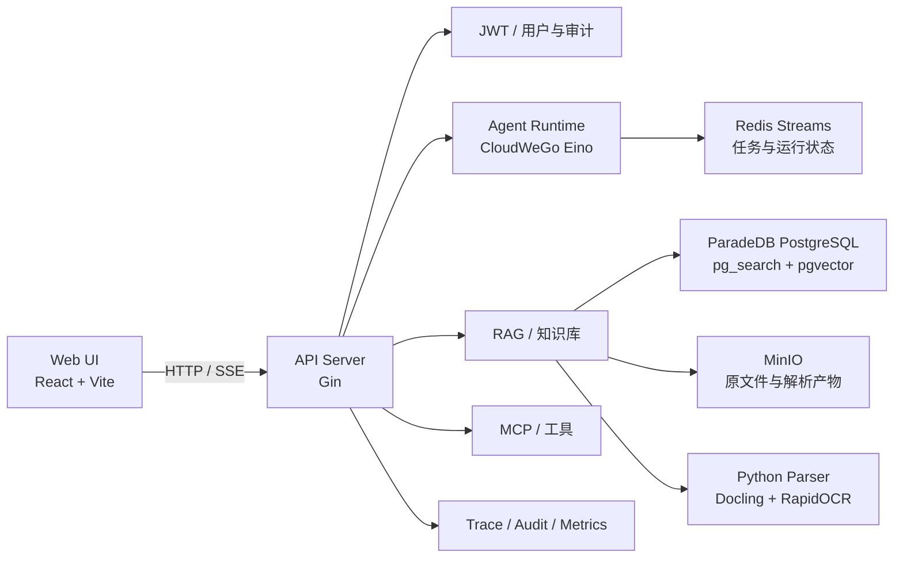

# Memora

> 面向个人与团队的 AI 知识库、文档理解与可追溯问答平台。

Memora 将多格式文档导入、结构化解析、混合检索、引用定位、模型管理和 Agent 对话整合在同一个全栈项目中。后端采用 Go、Gin 与 CloudWeGo Eino，管理端基于 React 与 Vite，数据层由 ParadeDB PostgreSQL、pgvector、Redis 和 MinIO 组成，并通过 Python Docling 提供复杂文档解析能力。

[快速开始](#快速开始) · [核心能力](#核心能力) · [系统架构](#系统架构) · [技术栈](#技术栈) · [项目文档](#项目文档) · [License](#license)

[GitHub](https://github.com/1090-f/Memora) · [API 说明](docs/API.md) · [后端架构](docs/ARCHITECTURE.md) · [开发指南](docs/DEVELOPMENT.md)

## Memora 是什么

Memora 不是一个只负责上传和搜索文件的网盘。它提供从原始文档到可验证回答的完整链路：导入文件或网页，解析并保留文档结构，建立关键词与向量索引，通过 RRF 和可选 Reranker 召回内容，最终把答案关联到原文片段与页面位置。

项目适合个人知识管理、团队内部知识库、RAG 应用验证，以及文档解析与检索系统的工程实践。

## 核心能力

| 能力 | 说明 |
| --- | --- |
| 知识库管理 | 创建知识库、默认目录、搜索配置和 Agent 配置，支持独立绑定所需模型 |
| 多源文档导入 | 支持手工文档、批量文件、安全 URL 与 ZIP 文件夹导入；单文件最大 50 MB，单次最多 20 个文件 |
| 文档理解 | 使用 Docling、RapidOCR 和 ONNX Runtime 解析 PDF、Office 文档与图片，可启用 OCR、表格结构识别、图片提取和页面定位 |
| 混合检索 | 同时使用 `pg_search` 关键词索引与 `pgvector` 向量索引，通过 RRF 融合结果，并可接入 Reranker |
| 可验证引用 | 正文预览直接读取完整 Parsed Artifact，回答引用通过 Chunk 与 `block_ids` 回溯到原文和页面 |
| 模型管理 | 统一配置 OpenAI 兼容的 Chat、Embedding 与 Reranker 模型，API Key 加密存储 |
| Agent 对话 | 提供知识库对话、Agent Run 列表与详情、记忆管理及运行过程查看 |
| MCP 工具 | 管理 MCP Server 和工具状态，为 Agent 扩展外部能力 |
| 异步任务 | 使用 Outbox 与 Redis Streams 处理文档解析、预览、索引等后台任务 |
| 可观测性 | 提供请求追踪、审计日志、健康检查、Worker 状态和 Prometheus 指标 |

## 界面与工作流

React 管理端围绕知识库工作流组织，包含知识库列表、文档工作区、对话、Agent Run、记忆、检索测试、模型设置、MCP 管理和个人资料等页面。

推荐使用顺序：

1. 在“模型设置”中配置 Chat 模型，并按需配置 Embedding 与 Reranker。
2. 创建知识库并设置检索和 Agent 参数。
3. 上传文档、导入文件夹 ZIP、粘贴 URL，或直接创建手工文档。
4. 等待解析和索引完成，在“检索测试”中验证召回结果。
5. 进入对话页提问，通过引用跳转到完整正文或原文件定位依据。

## 系统架构



后端以模块化单体部署，主要业务按 API → Service → Repository 分层。文档消费者运行在 `memora-server` 进程内，不需要单独启动 Worker；Python 解析服务也由主程序托管，模型就绪后才开放 API，并在主程序退出时回收。

文档加工链路：

```text
导入 → 解析 → 清洗 → 结构化分段 → 可选向量化 → 关键词索引 → 完成
```

## 技术栈

| 层次 | 技术 |
| --- | --- |
| 后端 | Go 1.25、Gin 1.12、GORM、CloudWeGo Eino |
| 管理端 | React 19、TypeScript 5.9、Vite 6、MUI、TanStack Query、Redux Toolkit |
| 文档解析 | Python 3.11、FastAPI、Docling、RapidOCR、ONNX Runtime |
| 数据库与检索 | ParadeDB PostgreSQL 17、`pg_search`、`pgvector` |
| 队列与缓存 | Redis 7、Redis Streams |
| 对象存储 | MinIO |
| 基础设施 | Viper、Zap、JWT v5、Argon2id、golang-migrate |
| 工程化 | Docker Compose、uv、pnpm 10.12.1 |

## 快速开始

### 前置环境

最简单的完整启动方式只需要：

| 依赖 | 要求 | 用途 |
| --- | --- | --- |
| Git | 可用版本 | 获取源码 |
| Docker | Docker Engine 或 Docker Desktop | 构建并运行全部服务 |
| Docker Compose | Compose v2 | 服务编排 |

### 1. 获取代码

```bash
git clone https://github.com/1090-f/Memora.git
cd Memora
```

### 2. 创建配置

PowerShell：

```powershell
Copy-Item .env.example .env
```

Bash：

```bash
cp .env.example .env
```

启动前至少修改 `.env` 中的以下配置：

- `MEMORA_JWT_SECRET`：JWT 签名密钥。
- `MEMORA_BOOTSTRAP_ADMIN_PASSWORD`：初始管理员密码，至少 12 个字符。
- `MEMORA_MCP_ENCRYPTION_KEY`：MCP 凭据加密密钥。
- `MEMORA_AI_ENCRYPTION_KEY`：模型 API Key 加密密钥。

发布模式下不得继续使用 `change-me` 开头的示例密钥或密码。

### 3. 启动服务

```powershell
docker compose --env-file .env -f deploy/docker-compose.yml up --build
```

Compose 会启动 PostgreSQL、Redis、MinIO、API 和管理端，并自动执行数据库迁移与管理员初始化。Python 3.11、uv、Docling 依赖和解析源码已经包含在 API 镜像中，不会创建独立的 `document-parser` 容器；模型缓存在 `docling-models` 数据卷中。

首次构建和首次启动需要下载 Python 依赖及 Docling 模型，耗时会明显长于后续启动。API 容器默认限制为 4 GB 内存。

### 4. 访问与验证

| 服务 | 地址 |
| --- | --- |
| 管理端 | <http://localhost:3000> |
| API | <http://localhost:8080> |
| MinIO Console | <http://localhost:19001> |
| Liveness | `GET http://localhost:8080/health/live` |
| Readiness | `GET http://localhost:8080/health/ready` |
| 后台消费者状态 | `GET http://localhost:8080/health/workers` |
| Prometheus 指标 | `GET http://localhost:8080/metrics` |

默认管理员邮箱是 `admin@example.com`，密码为你在 `.env` 中设置的 `MEMORA_BOOTSTRAP_ADMIN_PASSWORD`。

停止服务：

```powershell
docker compose --env-file .env -f deploy/docker-compose.yml down
```

> 如需同时删除数据库、对象文件和模型缓存卷，可明确执行 `down -v`。该操作不可恢复。

## 模型使用边界

三类模型承担不同职责，并非创建知识库时全部必填：

| 模型 | 创建知识库 | 文档导入 | 检索与问答 |
| --- | --- | --- | --- |
| Chat | 必须指定启用模型，或已有默认 Chat 模型 | 不参与解析和分段 | 用于 Agent 与问答 |
| Embedding | 可选 | 未配置时仍会建立关键词索引 | Vector / Hybrid 检索必须配置 |
| Reranker | 可选 | 不参与文档加工 | 未配置或调用失败时保留 RRF 结果 |

没有 Embedding 模型时，文档会显示为“已完成（仅关键词）”；成功生成向量后显示“已完成（混合索引）”。解析和分段本身不依赖 Embedding 或 Reranker。

## 文档导入与预览

| 类型 | 支持格式与行为 |
| --- | --- |
| 文本 | Markdown（`.md`、`.markdown`）和 `.txt`，保留标题、列表、代码块与表格等结构 |
| 文档 | `.pdf`、`.docx`、`.pptx`、`.xlsx`，支持解析正文与原文件预览；启用 LibreOffice 时可生成 PDF 高保真回退 |
| 图片 | `.jpg`、`.jpeg`、`.png`、`.bmp`、`.tiff`、`.tif`、`.gif`、`.webp`，通过 OCR 提取内容 |
| 文件夹 | `.zip` 作为文件夹传输容器，安全解压后为其中的受支持文件分别创建任务 |
| 网页 | 安全抓取 URL 并展示清洗后的文章正文 |

所有文件导入文档均提供独立的原文件下载入口，版式预览不会替代源文件。正文预览读取完整 Parsed Artifact，不使用检索 Chunk 反向拼接，因此不会因分段策略丢失标题、列表或段落结构。

处理状态包括：待处理、解析中、清洗中、分段中、向量化中、关键词索引中、已完成和失败。导入任务的“成功”表示当前可用索引已经建立；具体是关键词索引还是混合索引，以文档的 `index_mode` 为准。

## 源码开发

### 环境要求

- Go 1.25
- Node.js 24、Corepack、pnpm 10.12.1
- Python 3.11 和 [uv](https://docs.astral.sh/uv/)
- ParadeDB PostgreSQL 17（`pg_search` + `pgvector`）、Redis 7、MinIO

复制本地配置：

```powershell
Copy-Item configs/config.yaml.example configs/config.yaml
Copy-Item .env.example .env
```

环境变量优先于 `configs/config.yaml`，统一使用 `MEMORA_` 前缀。请根据本机环境修改 PostgreSQL、Redis 和 MinIO 地址及凭据。

### 启动后端

```powershell
go run ./cmd/server
```

服务启动时会自动执行数据库 Migration，并在配置了引导管理员环境变量时创建管理员。维护命令：

```powershell
go run ./cmd/migrate up
go run ./cmd/migrate bootstrap-admin
go run ./cmd/migrate reset-admin-password
```

`document_parser.auto_start` 默认开启。主程序通过 `uv` 在 `services/document-parser` 中同步锁定依赖并启动 `127.0.0.1:5001`。如果该端口已有健康的解析服务，主程序会直接复用，退出时不会关闭这个外部进程。

Windows 仓库路径包含中文时，建议在 `configs/config.yaml` 中把 Python 环境放到纯 ASCII 路径，避免 Docling C++ 组件读取字体资源失败：

```yaml
document_parser:
  auto_start_environment:
    PYTHONUTF8: "1"
    TORCH_COMPILE_DISABLE: "1"
    UV_PYTHON: "3.11"
    UV_PROJECT_ENVIRONMENT: "C:/venv/document-parser"
```

### 启动管理端

```powershell
Set-Location web
corepack enable
pnpm install --frozen-lockfile
pnpm dev
```

开发服务器默认将 `/api/v1` 代理到 `http://localhost:8080`。前端环境变量示例位于 `web/.env.example`。

## 项目结构

```text
Memora/
├── cmd/
│   ├── server/                  # API、后台消费者与解析器生命周期入口
│   └── migrate/                 # Migration 与管理员维护命令
├── configs/                     # YAML 配置示例
├── deploy/                      # Docker Compose 与 PostgreSQL 初始化
├── docs/                        # 架构、接口和专项设计文档
├── internal/
│   ├── api/                     # HTTP 路由、Controller 与响应协议
│   ├── app/                     # 应用装配和生命周期
│   ├── background/              # Outbox 与 Redis Streams 消费者
│   ├── repository/              # PostgreSQL 数据访问
│   └── service/                 # 业务服务、RAG、索引、检索与引用
├── pkg/                         # 配置、日志、数据库、JWT、MinIO 等基础设施
├── scripts/migrations/          # SQL Migration
├── services/document-parser/    # FastAPI + Docling 解析服务
├── web/admin/                   # React 管理端
├── go.mod
├── Makefile
└── README.md
```

## 常用命令

后端：

```powershell
go run ./cmd/server   # 启动后端
go test ./...         # 运行测试
go vet ./...          # 静态检查
go build ./cmd/...    # 构建命令
```

管理端（在 `web/` 目录执行）：

```powershell
pnpm --filter memora-admin test
pnpm lint
pnpm typecheck
pnpm build
```

Python 解析器（在 `services/document-parser/` 目录执行）：

```powershell
uv sync --frozen
uv run ruff check .
uv run mypy app.py schemas.py docling_adapter.py
uv run pytest
```

仓库也提供 `make build`、`make run-server`、`make migrate`、`make test`、`make fmt` 和 `make vet` 等命令。

## 项目文档

- [API 说明](docs/API.md)
- [前端说明](docs/FRONTEND.md)
- [后端架构](docs/ARCHITECTURE.md)
- [开发规范](docs/DEVELOPMENT.md)
- [Docling 解析服务](services/document-parser/README.md)
- [Docling 文档解析执行方案](docs/2026-08-08-docling-document-parsing-execution-plan.md)

README 只维护项目入口、能力边界和启动流程；完整接口字段与专项设计以对应文档和当前代码为准。

## 开发注意事项

1. 不要在开发环境之间共用 Redis Stream 消费组，否则任务可能被其他实例领取。
2. 首次启动前确认 ParadeDB 已提供 `pg_search` 与 `pgvector` 扩展。
3. Redis、MinIO 或 Python 解析服务异常会使 Readiness 检查失败；后台消费者状态由 `/health/workers` 单独提供。
4. 模型密钥和服务凭据只写入本地 `.env` 或配置中心，不要提交真实配置。
5. 修改后优先运行相关模块的窄范围测试，再按影响范围执行完整检查。

## License

本项目基于 [MIT License](LICENSE) 开源。
