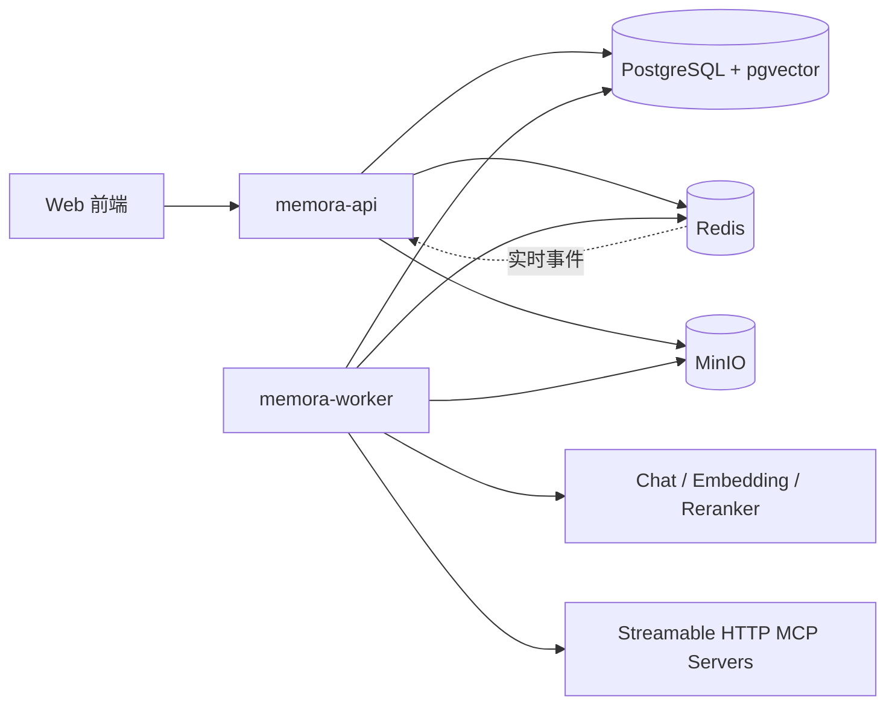

# Memora MVP P0 后端架构设计

> 状态：已完成方案评审，待书面规格复核  
> 日期：2026-07-31  
> 依据：`AI智能知识库与知识服务Agent系统需求规格说明书_统一问答与长期记忆版.md`

## 1. 目标与范围

本设计覆盖 Memora MVP P0 后端框架，包括个人知识库、文档导入与索引、混合检索、会话上下文、跨会话长期记忆、Router Agent、ReAct-RAG、Plan-Execute、Agent Core、只读 MCP、SSE、运行控制、安全、测试和部署。

P0 不包含多租户、多人协作、OCR、知识图谱、写工具、代码执行、SubAgent、多 Agent、可视化工作流和任意节点 Checkpoint。Agent 运行中断后只支持整体重试，不支持从任意节点恢复。

## 2. 技术基线与架构决策

- 语言与 HTTP：Go、Gin。
- 持久化：PostgreSQL、pgvector；普通 CRUD 使用 GORM，全文检索、向量检索、RRF、锁和批量任务使用原生 SQL。
- 缓存与信号：Redis，不作为核心业务数据的唯一存储。
- 对象存储：MinIO，按 S3 语义封装。
- AI 编排：Eino，但只允许存在于模型和 Agent 适配层。
- 架构形态：模块化单体，同一仓库构建独立 API 和 Worker 进程。
- 异步可靠性：PostgreSQL 保存任务和事件真相，Redis提供低延迟通知、停止信号和并发控制。

不采用微服务。当前三人团队优先保证契约、事务、测试和端到端闭环；模块成熟后仍可沿现有接口拆分。

## 3. 运行拓扑



`memora-api` 负责 REST、JWT、参数校验、普通短事务、异步任务创建、状态查询和 SSE。`memora-worker` 负责文档处理、索引构建、AgentRun、MemoryExtractor、索引清理和文件清理。API 请求协程不得直接执行完整文档处理或 Agent 运行。

## 4. 工程结构与依赖规则

```text
cmd/
├── memora-api/
├── memora-worker/
└── memora-migrate/
internal/
├── app/{api,worker}/
├── contracts/
├── modules/
│   ├── identity/ knowledgebase/ document/ ingestion/
│   ├── indexing/ retrieval/ conversation/ memory/ model/
│   ├── router/ agentcore/ react/ planexecute/ tool/ mcp/
└── platform/
    ├── config/ database/ cache/ objectstore/ task/
    └── crypto/ logging/ observability/ httpclient/
migrations/
deploy/
docs/{architecture,contracts,openapi}/
tests/{integration,e2e}/
```

复杂模块内部按 `domain`、`application`、`ports`、`adapters` 组织。小模块不机械创建空层级。

依赖规则：

1. Domain 不依赖 Gin、GORM、Eino、Redis、MinIO。
2. Application 只依赖 Domain、Ports 和稳定 contracts。
3. Adapters 实现 Ports，并封装框架或外部系统。
4. `cmd` 与 `internal/app` 是组合根，负责依赖注入和生命周期。
5. 模块间只能通过 Facade 或 contracts 调用，不能访问对方 Repository、表模型或 Eino 状态。
6. 不建立万能 `utils`；公共能力必须有明确责任归属。

## 5. Contracts v0.1

`internal/contracts` 保存跨模块 DTO、接口、枚举和公共错误，不保存 GORM Model、Gin DTO、Prompt 和实现。

开发前冻结：

- `RetrievalRequest`、`RetrievalResult`、`RetrievalHit`、`SufficiencyStatus`；
- `Citation`、`KnowledgeCitation`、`WebCitation`；
- `ConversationContext`、`MemoryQueryResult`、`AgentContext`；
- `RouterDecision`；
- `ToolContext`、`ToolCall`、`ToolResult`；
- `AgentRun`、`Usage`、`Plan`、`PlanStep`、`ReviewerResult`；
- `AgentEvent` 与带版本的事件 Payload；
- `ModelFactory` 和公共错误码。

公共规范：后端生成 UUIDv7；数据库时间统一为 UTC `timestamptz`，API 使用 RFC 3339；JSON 使用 `snake_case`；普通列表使用页码分页，消息和事件使用 Cursor；跨模块扩展数据使用带版本的 `json.RawMessage`，不传播任意 `map[string]any`。

错误响应包含稳定 `code`、安全 `message`、可选 `details`、`retryable` 和 `trace_id`。内部堆栈、SQL、Prompt 和敏感参数只进入受控内部日志，不能返回客户端。

## 6. 身份、配置与运行上下文

JWT 包含 `sub`、`sid`、`token_version`、`iat`、`exp`。登录创建持久化 Session，Redis 缓存状态；退出登录撤销 Session，使对应令牌立即失效。

运行上下文逐级收敛：

```text
RequestContext
└── UserID, SessionID, TraceID, ClientIP

KnowledgeContext
└── UserID, KnowledgeBaseID, NetworkEnabled, AgentConfigID

ToolContext
└── UserID, KnowledgeBaseID, AgentRunID, AllowedToolNames, NetworkEnabled
```

身份字段由后端注入，模型不可见、不可修改。数据归属不匹配对外统一表现为资源不存在，避免泄露资源是否存在。

配置优先级为默认值、配置文件、环境变量、启动参数。关键依赖或密钥缺失时启动失败。生产环境只使用显式版本化 Migration，不使用 GORM AutoMigrate。

## 7. 知识库、文档和异步任务

知识库是数据和配置隔离边界。创建知识库、默认目录、SearchConfig、AgentConfig 必须在一个应用事务内完成。所有文档、片段、向量、会话和知识库级 Memory 都按 `UserID + KnowledgeBaseID` 校验。

文档数据区分逻辑文档、附件、内容版本、索引版本、片段和向量。处理状态为：

```text
pending → parsing → cleaning → chunking → embedding
        → keyword_indexing → ready
任意处理中状态 → failed → pending（整体重试）
```

删除状态独立管理。文档逻辑删除后立即停止搜索和读取，片段、向量与对象文件由后台清理。

文件导入流式校验 MIME、大小和 SHA256，先写 MinIO 临时对象，再创建 Document、Attachment 和 Job；失败临时对象由清理任务回收。URL 导入只允许 HTTP/HTTPS，对每次 DNS 解析、实际连接和重定向执行 SSRF 校验，并将网页快照保存到 MinIO 后进入统一处理链。

统一 Job 保存状态、步骤、尝试次数、幂等键、可执行时间、租约、心跳和错误码。Worker 使用 `FOR UPDATE SKIP LOCKED` 领取任务，按租约和心跳回收崩溃任务。任务步骤必须幂等，重试使用指数退避。逻辑队列分为 `document`、`agent`、`memory`、`cleanup`。

## 8. 版本化索引与 RetrievalService

文档流水线为：

```text
Loader → Parser → Cleaner → Chunker → Embedding
       → KeywordIndexer → VersionActivator
```

新索引在 `building` 状态独立构建。全部片段、关键词和向量成功后，事务内锁定文档，将旧 active 版本置为 inactive，并激活新版本。新版本失败时旧版本继续服务。旧数据延迟清理。

一个 IndexVersion 只使用一种 Embedding 模型和维度。`ChunkEmbedding` 使用 pgvector 存储并记录模型和维度；当前 Embedding Profile 建立相应的部分 HNSW 索引。更换维度必须生成新索引版本，不同维度不得参与同一次相似度查询。

统一检索链路：

```text
关键词 Top 30 + 向量 Top 30
→ RRF → ChunkID 去重 → 前 20
→ Reranker → 最终 5～8 条
→ SufficiencyStatus + Citation
```

所有检索同时过滤用户、知识库、文档状态和 active 索引版本。`RetrievalService` 只返回证据、分数、充分性和真实引用，不生成最终答案。知识充分性统一为 `SUFFICIENT`、`INSUFFICIENT`、`AMBIGUOUS`。

## 9. 会话、Memory 与 Router

提交问题时，在一个事务中保存 UserMessage、AgentRun 和 Agent Job，API 返回 RunID，前端随后连接 SSE。会话消息以单调 Sequence 排序。

`ConversationContextService` 保留当前问题和最近完整问答轮次，按 Token 预算从最早历史开始裁剪。指代补全只生成规范化检索问题，不修改原始消息。

Memory 类型固定为 preference、project、decision、goal、fact、progress；作用域为 user 或 knowledge_base。`MemoryRetriever` 按 UserID 强制过滤，分别召回全局和当前知识库 Memory，综合相似度、重要性和更新时间，再按条数与 Token 限制注入上下文。Memory 故障降级为只使用当前会话。

回答成功后异步运行 `MemoryExtractor`，只提取稳定且长期有价值的信息。`MemoryManager` 依次进行敏感信息过滤、规范化、Hash 精确去重、语义相似检索，再新增、合并、更新、失效或忽略。无法自动判断的冲突允许保留新旧两条。删除或 inactive Memory 立即停止召回。

`ContextBuilder` 生成一次运行不可变的 `AgentContext`。Router 只接收该上下文并输出结构化 `RouterDecision`，不调用工具。非法模式、解析失败或超时统一兜底 ReAct，并记录 fallback 原因；不保存完整思维链。

## 10. Agent Core 与执行引擎

AgentRun 状态：

```text
queued → running → completed | failed | timed_out
                 → cancelling → cancelled
```

整体重试创建新 Run，并通过 ParentRunID 关联原运行。Worker 崩溃后从头开始新执行尝试，不恢复任意节点。

Agent Core 包含 AgentRunService、RunController、BudgetController、ToolRegistry、ToolExecutor、CitationCollector 和 EventPublisher。默认限制为 ReAct 8 轮、Plan 5 步、重新规划 1 次、Reviewer 1 次、工具调用 10 次；同时限制模型 Token、运行时间、单次文档读取和工具结果大小。预算采用调用前预留、调用后结算。

项目定义自己的 `ExecutionEngine`，ReActEngine 与 PlanExecuteEngine 在 Adapter 内使用 Eino，业务层不接触 Eino 类型。

ReAct 循环在最终回答、预算耗尽、取消、超时或不可恢复错误时停止。检索不足时可改写查询；允许联网时可使用 MCP，否则明确提示依据不足。

Planner 输出最多 5 步的无环计划，ToolHint 必须存在且只读。Executor 按拓扑顺序串行执行。重新规划只替换未执行步骤且最多一次。Reviewer 只检查一次完整性与引用，不调用工具、不触发反思循环。两种执行模式最终都进入统一 Finalizer，保存回答后才创建 MemoryExtractor Job。

## 11. Tool 与 MCP 安全

ToolExecutor 的固定执行链为：状态校验、身份校验、Registry 查询、启用与只读校验、联网与 Allowlist 校验、JSON Schema 校验、预算预留、超时执行、结果归一化、大小截断、引用验证、调用记录和事件发布。

内置工具为 KnowledgeSearchTool 和分页/Token 受限的 DocumentReadTool。MCP 工具运行名为 `mcp.<server_id>.<tool_name>`，授权精确到用户、知识库和 AgentConfig。

P0 只允许 Streamable HTTP 与只读搜索、读取、查询工具。MCP 的只读声明只是参考，还必须通过本地安全分类与用户显式授权。创建、修改、删除、发布、发消息、执行代码和系统命令等工具禁止启用。

MCP 凭证和模型 Key 使用信封加密与 AES-256-GCM，主密钥仅来自运行环境或外部 Secret。跨域重定向不得转发认证 Header。URL 与 MCP 共用安全 HTTP Client，阻止回环、私网、链路本地、保留地址和云元数据地址，并防御 DNS Rebinding。

外部工具与网页内容一律视为不可信数据：限制长度、清理控制字符、与系统指令明确分隔，不允许扩大 ToolContext 权限，也不采用网页中伪造的 Citation。

## 12. AgentEvent 与 SSE

事件先写 PostgreSQL，再通过 Redis Pub/Sub 实时通知。每个 Run 的 Sequence 单调递增且唯一。SSE 建立连接时先订阅，再补查 `Sequence > Last-Event-ID` 的数据库事件，按 Sequence 排序去重；断开连接不取消 AgentRun。

`answer.delta` 按短时间窗口或字符数合并后持久化，避免逐 Token 写数据库。允许展示路由、Memory 命中、Plan、步骤、轮次、工具摘要、Usage、Citation 和最终状态；禁止展示完整思维链、隐藏 Prompt、密钥和未脱敏参数。

Redis 不可用时，API 从 PostgreSQL 轮询事件和取消状态。SSE 重连后按 Sequence 续传。

## 13. API 边界

统一前缀为 `/api/v1`。主要资源包括：

- `/auth`：登录、退出、当前用户；
- `/knowledge-bases`：知识库、目录、搜索配置、Agent 配置；
- `/documents`、`/imports`：文档、文件/URL 导入、处理状态和重试；
- `/search`：关键词、语义、混合和检索测试；
- `/conversations`：会话、消息和问题提交；
- `/agent-runs`：运行详情、SSE、取消和整体重试；
- `/memories`：列表、查看、删除和停用；
- `/model-configs`：模型配置；
- `/mcp/servers`：Server、连接测试、发现和工具授权。

异步创建返回 202 和 JobID/RunID；创建返回 201；删除返回 204；状态冲突返回 409；参数语义错误返回 422。导入和 AgentRun 创建支持 `Idempotency-Key`。OpenAPI 是 HTTP 契约唯一正式来源，API 不返回数据库 Model。

## 14. 数据、迁移与一致性

一个 PostgreSQL Schema 保存身份、知识库、文档/索引、模型、会话、Agent、Memory、MCP、Job 和审计表。数据库约束保证同一文档只有一个 active 索引版本、同一会话 Message Sequence 唯一、同一 Run Event Sequence 唯一、Job 幂等键唯一，并为外键过滤字段、tsvector 和向量建立适当索引。

用户、知识库或文档删除先在事务内逻辑失效，使数据立即不可访问，再由 Worker 分批物理清理。大表索引并发创建，破坏性字段删除跨两个版本完成，数据回填使用独立 Job。

## 15. 可观测性与降级

结构化日志在适用时携带 trace_id、user_id、knowledge_base_id、agent_run_id、job_id、tool_call_id、duration_ms 和 error_code。高基数业务 ID 不作为 Metrics Label。

核心指标覆盖 HTTP、SSE、Job、文档阶段、检索、Memory、Router、AgentRun、模型、工具、MCP 与预算耗尽。异步 Job 保存 Trace Context 并创建子 Trace。

`/health/live` 只判断进程存活；`/health/ready` 检查当前进程必需的 PostgreSQL、Redis、MinIO 和 pgvector。模型或单个 MCP 不作为 API 就绪的强制条件。

降级规则：MCP 失败继续本地知识库；Memory 失败仅使用当前会话；Reranker 失败使用 RRF；查询 Embedding 失败使用关键词检索；文档 Embedding 失败则新版本不激活；MinIO 失败禁止新导入但不影响已有索引问答。

## 16. 测试与质量门禁

- 单元测试：领域规则、状态机、预算、RRF、Memory 合并、Plan DAG、错误映射、SSRF。
- Contract 测试：Mock/真实实现一致、AgentEvent 兼容、OpenAPI、MCP Adapter、Eino 边界。
- 集成测试：真实 PostgreSQL+pgvector、Redis、MinIO，覆盖迁移、事务、索引切换、任务租约、SSE 补发和数据隔离。
- AI 确定性测试：Fake ChatModel、Embedding、Reranker，不在 CI 调用收费模型。
- E2E：覆盖 ReAct 知识问答与引用、跨会话 Memory，以及 Plan-Execute、重规划和 Reviewer 两条主链。

合并门禁包括 gofmt、go vet、golangci-lint、单元测试、Race Detector、Contract 测试、Migration 验证、漏洞/密钥扫描、架构依赖检查和核心集成测试。

## 17. 部署与扩容

开发环境 Docker Compose 包含 API、Worker、PostgreSQL+pgvector、Redis、MinIO 和初始化容器。API 无本地持久化状态，可水平扩容；Worker 按 document、agent、memory、cleanup 队列分别扩容。并发限制覆盖全局、队列、单用户 Agent、单知识库索引、模型调用和 MCP Server。

API 与 Worker 使用同一镜像和不同命令，容器使用非 root 用户，密钥通过 Secret 注入，PostgreSQL 定期备份。

## 18. 分阶段交付

1. Foundation：工程、配置、迁移、contracts、错误、日志、JWT、Mock。
2. Knowledge：知识库、目录、文档、文件/URL 导入、Job、MinIO。
3. RAG：处理流水线、Embedding、混合检索、Reranker、Citation、版本切换。
4. Context：Conversation、Memory、ContextBuilder、Router。
5. Agent Core 与 ReAct：运行、预算、取消、工具、ReAct、SSE。
6. Plan-Execute：Planner、DAG、Executor、Replan、Reviewer。
7. MCP：配置、发现、授权、搜索/网页读取、安全。
8. 联调验收：两条端到端主链、降级、性能、安全和演示数据。

开发采用 contracts v0.1 先行、确定性 Mock 并行、持续联调、逐步替换 Mock 的方式。成员一负责 RAG，成员二负责 Context/Memory/Router/Plan，成员三负责 ReAct/Agent Core/Tool/MCP；三方不得复制检索、工具执行或上下文装配逻辑。

## 19. 架构验收结论

实现必须能证明：数据按用户和知识库隔离；删除立即失效；旧 active 索引在新索引失败时继续可用；Router 只路由；两种执行模式共用 Agent Core 和 ToolExecutor；身份由后端注入；运行可停止且受预算限制；SSE 可续传；引用可追溯；Memory 可查看删除且不是事实引用；MCP 只读、受授权并防 SSRF；日志和事件不暴露密钥、隐藏 Prompt 或完整思维链。
